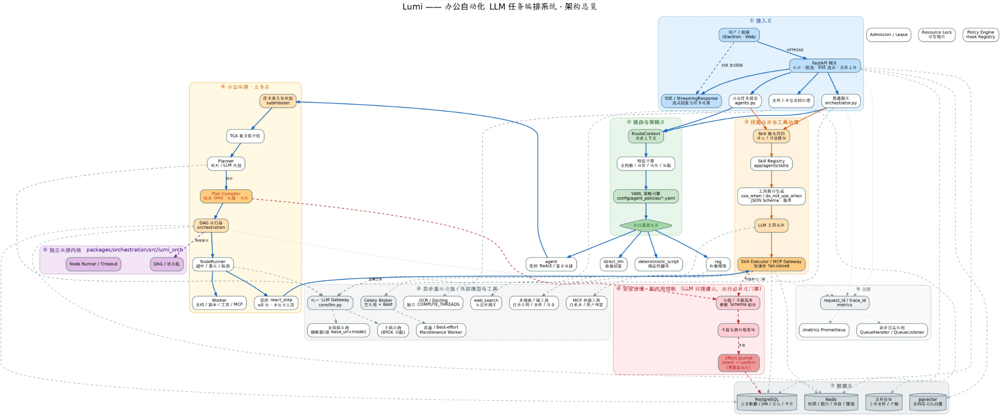

# Lumi Backend

多模态 AI 助手后端：聊天（流式 SSE）、RAG 知识库、长期记忆（加密）、办公模式（文档编辑/脚本执行/多智能体编排）、语音（TTS/ASR）。

## 项目背景
- 在折腾大模型应用的过程中，我越来越感到一种割裂感：现有的 AI 助手在“闲聊”时表现惊艳，
- 但一旦让它们真正接手办公任务（比如“帮我改一下这份 50 页的合同并给客户发封邮件”），
- 它们往往会变成灾难——要么读两页文档就忘了前面的设定，要么胡乱调用工具导致重复发邮件，
- 甚至被文档里的“忽略安全规则”一句话就给越狱了。

- 我意识到，将 LLM 落地到真实生产环境，缺的不是一个更聪明的模型，而是一个能管住它的工程底座。

- Lumi 就是我对这个问题的回答。我不想再做一个套壳的聊天框，而是试图打造一个“任务级控制面”：
- 用 DAG 编排约束它的行为，用两段式日志兜底它的副作用，用四域 RAG 防止它产生记忆错乱。
- Lumi 不是一个能让 AI 更聪明的系统，而是一个让 AI 在干粗活时不出大乱子的系统。

## 系统架构


## 技术栈

- Python 3.13 / FastAPI / SQLAlchemy(async) + PostgreSQL(pgvector)
- Redis（缓存 / Celery broker / 短期记忆 / 限流）
- `lumi-orchestration` 内核 + 持久化 DAG（当前办公任务主路径）；Temporal 仅灰度静态只读工作流
- Celery（异步任务 + Beat 定时调度）
- MCP 混合架构（服务端技能原生调用，客户端技能经 Electron MCP 直连）

## 快速启动（开发）

```bash
# 依赖（uv）
uv sync

# 配置
cp .env.example .env   # 填写密钥

# 数据库：先建库（PostgreSQL + pgvector），再迁移
uv run alembic upgrade head

# 启动后端
uv run uvicorn app.main:app --reload --port 8000
```

前端（Electron + Vite）在独立仓库，后端默认 `http://localhost:8000`。

## 常用命令

```bash
uv run pytest tests -q            # 测试
uvx ruff check app tests          # 静态检查
uv run alembic upgrade head       # 数据库迁移
uv run alembic revision --autogenerate -m "描述"   # 模型变更生成迁移
uv run celery -A celery_app.celery_app worker -l info   # 异步 worker
uv run celery -A celery_app.celery_app beat -l info     # 定时调度
```

## Docker 部署

```bash
docker compose up -d
# 生产建议叠加 Docker secrets：
# docker compose -f docker-compose.yml -f docker-compose.secrets.yml up -d
```

详见 [docs/OPERATIONS.md](docs/OPERATIONS.md)（部署/定时任务/迁移/密钥/备份/排障）与
[docs/DEGRADATION.md](docs/DEGRADATION.md)（降级与容错矩阵）。

### 办公模式 Python 脚本沙箱

`python_exec` 默认只在 Docker 隔离沙箱中运行；Docker 或镜像不可用时，该工具会从办公模式能力列表中隐藏，绝不会回退为后端本地执行。

```bash
# 在运行 API 的服务器上构建一次；镜像不包含项目源码、密钥或用户文件
docker build -f Dockerfile.sandbox -t lumi-python-sandbox:latest .
```

生产环境应让 API 通过受限的 Docker context 或独立 sandbox runner 调用 Docker，不应把宿主 Docker socket 直接挂给 API 容器。每次脚本执行都会创建并销毁容器，禁网、只读根目录、非 root、去除 Linux capabilities，并限制 CPU、内存、PID、文件描述符和运行时间。任务输入使用复制方式进入容器，产物仅复制回已授权的用户输出目录。

## 架构文档

- [docs/RAG_DESIGN.md](docs/RAG_DESIGN.md) — RAG、知识库、办公附件与记忆的分域检索
- [docs/MEMORY_DESIGN.md](docs/MEMORY_DESIGN.md) — 长期记忆与隐私
- [docs/CURRENT_DAG_ARCHITECTURE.md](docs/CURRENT_DAG_ARCHITECTURE.md) — 当前办公 DAG、运行时、审批、恢复与验收基线
- [docs/TOOL_SKILL_EXECUTION_GUIDE.md](docs/TOOL_SKILL_EXECUTION_GUIDE.md) — 工具选择、执行门禁与结果回流
- [docs/MCP_SKILL_GOVERNANCE.md](docs/MCP_SKILL_GOVERNANCE.md) — Skill 生命周期、候选池评测与外部 MCP 准入
- [docs/DAG_MCP_PITFALLS.md](docs/DAG_MCP_PITFALLS.md) — 办公 DAG/MCP 的故障复盘与排障路线
- [docs/ROUTING_POLICY_MIGRATION.md](docs/ROUTING_POLICY_MIGRATION.md) — 路由策略与内核边界迁移
- [docs/ORCHESTRATION_KERNEL_PACKAGE.md](docs/ORCHESTRATION_KERNEL_PACKAGE.md) — 独立编排内核 workspace 包
- [docs/ORCHESTRATION_DEPLOYMENT_GUIDE.md](docs/ORCHESTRATION_DEPLOYMENT_GUIDE.md) — 编排部署、迁移与回归命令
- [docs/API_AUTH.md](docs/API_AUTH.md) / [docs/API_INTEGRATION.md](docs/API_INTEGRATION.md) — API 与鉴权
