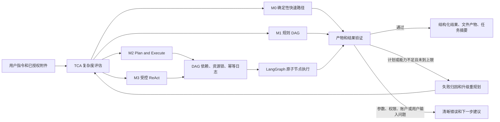
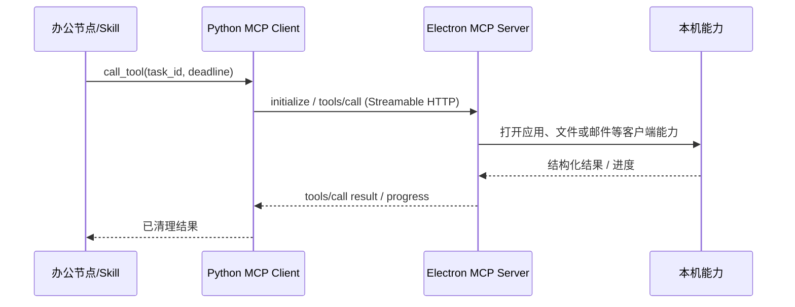

# 办公编排与 MCP 运行手册

> 版本：v2.0（2026-08-19）  
> 本文是办公模式 DAG、LangGraph/ReAct 与 MCP 的当前设计事实来源。

## 1. 边界与目标

Lumi 有两条明确隔离的链路：

| 模式 | 目标 | 可用能力 |
| --- | --- | --- |
| 普通聊天 | 对话、文档问答、识图、语音与受控检索 | `query_knowledge`、`web_search`、`get_datetime`；不进入办公编排，不暴露本地文件、Shell 或写操作 |
| 办公模式 | 有产物、跨文档、多步骤或需要外部动作的任务 | TCA 路由、确定性路径 / DAG / ReAct、资源锁、确认、审计与可取消任务 |

“智能体任务”不是一个锁定环境范围的独立运行时。办公任务被拆为可展示的原子步骤；步骤之间只能通过 DAG 依赖和声明的资源读写关系协作。普通办公 ReAct 则仅能看到审核过的办公能力，不能借由提示词取得开发工具、项目文件、环境变量或任意 Shell。

## 2. 总体执行闭环



闭环分为三层：

1. **入口路由**：TCA 只评估任务形状，不依赖某个业务名词。
2. **执行恢复**：节点失败先区分参数、计划、能力、瞬时和验证错误；仅允许有界重试或升级，避免死循环。
3. **经验沉淀**：仅成功的 M1/M2 计划可写入用户隔离的计划缓存；失败和取消任务绝不污染缓存。

## 3. TCA 与四级调度

`app/agents/orchestration/tca.py` 计算五个 0–1 维度：引用实体数、参数显式度、步骤依赖性、目标模糊度、历史依赖。规则高置信命中不调用 LLM；低置信时可接入注入式分类器。

| 层级 | 运行方式 | 典型任务 | 模型/工具开销 |
| --- | --- | --- | --- |
| M0 | 确定性单节点 | 已定位的单文件格式转换、当前时间 | 0 次规划 LLM |
| M1 | 规则模板 DAG | 固定报表、已知办公模板 | 0–1 次参数抽取 |
| M2 | Planner → 原子 DAG | 多文档合并、翻译后导出、固定依赖工作流 | 规划与汇总 LLM，节点逐步执行 |
| M3 | 单节点受控 ReAct | 必须依据中间观察改变方法的开放任务 | 每轮最多一个工具调用，最多 `max_rounds` 轮 |

M0 的结果必须验证真实产物是否存在、名称是否符合约定；失败后才升级到更高层。M2/M3 同样受结果验证器约束，而不是“模型说完成”就视为完成。

## 4. DAG、原子节点与执行运行时

### 4.1 规划与调度

Planner 的优先顺序是：确定性转换 → 模板 → 模式 → LLM 规划。每个 DAG 节点只有一个目标，最多一次外部工具调用；读取后修改、检索后总结等动作必须拆成前后依赖节点。

提交前会校验：节点 ID 唯一、依赖存在且无环、Agent 已注册、参数满足要求、资源声明有效。当前办公任务在提交后会序列化为单链，因此同一任务同一时刻只执行一个原子步骤；资源锁仍覆盖跨任务的冲突。

- **主运行时**：Temporal Workflow，负责持久化、信号、长任务恢复与 Activity 重试。
- **回退运行时**：自建 asyncio DAG；仅在 Temporal 不可用或提交失败时使用。
- **节点运行时**：两条运行时共用 `LangGraphNodeRunner`：`execute → assess → retry/finish`，保证超时、质检、换工具与错误分类语义一致。

写入型节点使用副作用幂等日志；Temporal 重试或进程崩溃恢复时，不应重复发送邮件、写文件或执行其他不可逆动作。

### 4.2 M3 ReAct

`OfficeReactRunner` 是一个受控的 LangGraph 循环，并非开放式 Agent：

```text
agent → before_tool → tools → after_tool → agent / finish
```

- 每轮最多接受一个工具调用。
- 每轮根据原始指令、上一工具、最新观察和失败集合重新筛选候选。
- 每轮最多暴露 8 个工具；失败工具会从后续候选中剔除。
- 工具带领域、意图标签、冲突与优先关系；例如“CSV 转 TXT 并生成文件”优先 `python_exec`，避免退化为逐行阅读和口述。
- 普通办公 ReAct 不暴露 `git`、项目读写、任意 Shell、环境变量、安装依赖等开发能力。
- ReAct 的消息状态即 scratchpad：`AIMessage(tool_calls)` 与 `ToolMessage` 由 LangGraph 的 `add_messages` 累积，下一轮可见上一轮工具观察；该 scratchpad 不直接展示给用户。

## 5. 任务状态、限流与前端展示

任务状态以 Temporal 为权威，Redis 保存快照、进度和索引。SSE 断开不会取消后台办公任务；只有 `POST /agents/jobs/{job_id}/cancel` 才是明确终止。

准入使用 Redis ZSET 租约（Redis 故障时回退进程内实现）：

- 短期规划槽：`AGENT_SUBMISSION_MAX_INFLIGHT`，默认 8；满载即返回背压，不排长队。
- 全局活跃任务：`AGENT_GLOBAL_ACTIVE_JOB_LIMIT`，默认 32。
- 单用户活跃任务：`AGENT_USER_ACTIVE_JOB_LIMIT`，默认 2。

前端只展示运行中或已完成的步骤。步骤包含人类可读的思考/执行描述、状态、耗时和结果摘要；完成后默认折叠。状态快照短暂缺失时应显示省略号兜底，而不是误判任务已经结束。

## 6. 能力与安全边界

### 6.1 Skill

`ToolCapability` 使用统一元数据：名称、参数 Schema、来源、权限、写操作、幂等性、资源模板、领域、意图标签、冲突和优先关系。权限与可用性在模型看见工具之前完成裁决；运行时仍再次校验。

所有用户消息、附件、RAG 片段、网页和 MCP 输出都是不可信数据。它们不能授予用户身份、跨用户资源范围、数据库访问、服务端文件访问、密钥访问或新工具权限。服务端/沙箱输出在进入模型、日志和前端前会清理绝对路径、密钥和内部错误信息。

### 6.2 脚本沙箱

`python_exec` 默认只在 Docker 隔离沙箱可用；沙箱不可用时该能力会在路由阶段隐藏，而不是退回后端本机执行。脚本产物只能写入已授权输出目录，前端拿到的是可审阅的产物信息，不是后端路径。

## 7. MCP 架构

### 7.1 角色与传输

MCP 采用官方 SDK 和标准 Streamable HTTP，不是自定义协议：



- **服务端能力**：Python Skill 原生执行，适合文档解析、RAG、业务逻辑与 Docker 沙箱。
- **客户端能力**：Electron 主进程通过 `electron/mcp-server.cjs` 暴露，适合打开应用、访问用户设备文件和邮件客户端。
- Electron 启动时启动 loopback MCP server，退出时关闭。默认地址是 `http://127.0.0.1:8765/mcp`。
- 后端通过 `MCP_SERVERS` 显式配置可连接的服务器。Docker 内的后端不能直接访问宿主 `127.0.0.1`；此时应使用受控 relay/host gateway，或者回退 Redis 客户端工具队列。

普通办公 ReAct 不进行全局 MCP 工具发现，避免无法判定“该 Electron 属于哪个用户”时发生客户端能力串线。MCP 仅通过已授权、具名的调用路径进入执行器；客户端工具仍须经过用户、角色、场景与确认校验。

### 7.2 MCP 会话与安全

Electron MCP server 的实现包括：

- 仅接受 `/mcp`，绑定 `127.0.0.1`；非 MCP 路径返回 404。
- Host/Origin allowlist 与 SDK 的 DNS rebinding 防护。
- 加密随机的 `mcp-session-id`，每个会话独立 Server、Transport 和**工具快照**；工具热更新只影响新会话。
- 默认最多 8 个会话，默认 10 分钟无活动会话回收。
- 请求体上限 10 MiB。

Python MCP client 的实现包括：

- 每个 server 一个串行 session worker，复用 `initialize` 后的连接；断线会清理并在下一次调用重新创建。
- 工具发现缓存 `MCP_TOOLS_CACHE_TTL_S`（默认 30 秒）。
- Circuit breaker 和 30 秒失败冷却；不可用时返回可分类错误并走既有 Redis 轮询降级。
- `MCP_TOOL_TIMEOUT_S`（默认 180 秒）控制 deadline。
- 调用携带标准进度关联元数据与 Lumi task id；取消办公任务或 deadline 到期时发送标准 `notifications/cancelled`，并中止本地等待。

> 取消是 best-effort：Electron 主进程内的能力必须自行接受 `AbortSignal` 才能真正中止底层子进程或系统调用；即使底层不可中断，调度器也不会继续等待其结果。

## 8. 关键配置

| 配置 | 默认值 | 用途 |
| --- | --- | --- |
| `AGENT_ORCHESTRATION` | `temporal` | `temporal` 优先，失败回退 `legacy` |
| `AGENT_NODE_TIMEOUT_SECONDS` | 120 | 单个原子节点上限 |
| `AGENT_NODE_MAX_RETRIES` | 1 | 节点的有界恢复次数 |
| `AGENT_USER_ACTIVE_JOB_LIMIT` | 2 | 单用户并发办公任务上限 |
| `AGENT_GLOBAL_ACTIVE_JOB_LIMIT` | 32 | 服务全局活跃办公任务上限 |
| `AGENT_SUBMISSION_MAX_INFLIGHT` | 8 | 规划阶段并发上限 |
| `AGENT_SANDBOX_TYPE` | `docker` | 脚本安全运行时 |
| `MCP_SERVERS` | `[]` | 后端允许连接的 MCP server 清单 |
| `MCP_TOOLS_CACHE_TTL_S` | 30 | MCP 工具清单缓存时间 |
| `MCP_TOOL_TIMEOUT_S` | 180 | MCP 工具 deadline |

## 9. 测试与排障

```powershell
# 后端完整测试
.\.venv\Scripts\python.exe -m pytest -q

# MCP 结果解析、缓存、任务关联、取消单测
.\.venv\Scripts\python.exe -m pytest -q tests/test_mcp_manager.py

# Electron MCP 标准协议冒烟测试
node electron/mcp-server.smoke.cjs
```

重点观测：TCA 层级命中、计划缓存命中、每节点耗时、LLM token、工具成功率、重规划率、MCP 连接/熔断/超时与取消。不要只看最终回答；多步骤任务的失败会跨节点放大。
