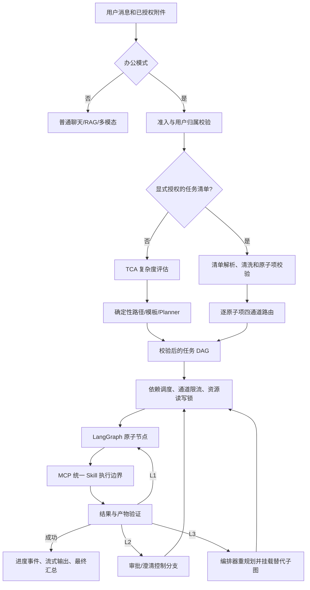
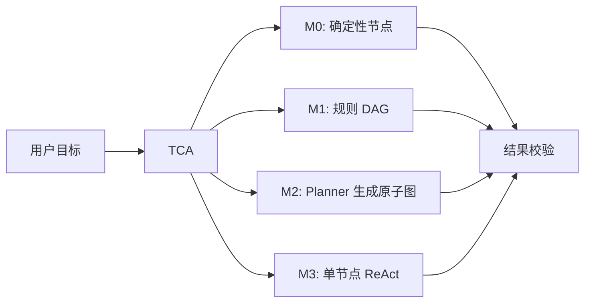
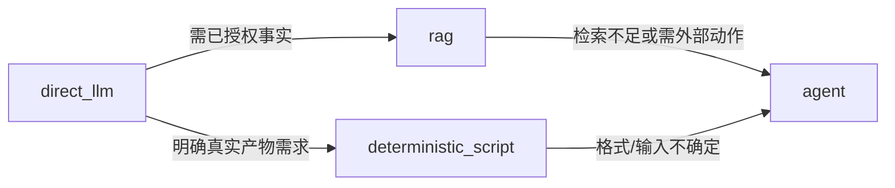
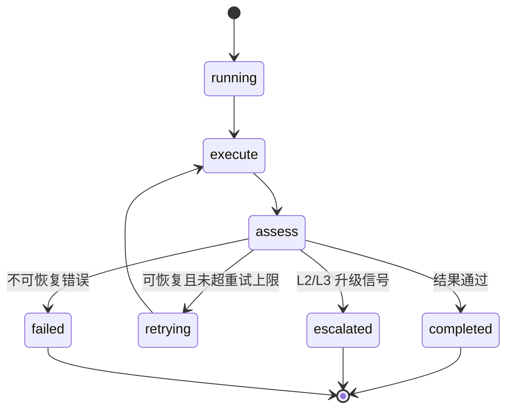

# 当前办公 DAG 架构说明

> 状态：以当前代码和 Docker 默认配置为准  
> 适用范围：办公模式；普通聊天不进入本文所述的 DAG  
> 相关代码：`app/agents/orchestration/`

## 1. 设计边界

Lumi 将普通聊天和办公自动化分成两条链路。

| 模式 | 入口能力 | 是否进入 DAG | 写操作与系统工具 |
| --- | --- | --- | --- |
| 普通聊天 | 对话、已上传文档问答、识图、语音、受控检索 | 否 | 不暴露办公写操作、本地文件、任意 Shell 或项目工具 |
| 办公模式 | 文档处理、产物生成、跨资料核对、外部动作、任务清单 | 是 | 仅在能力、用户、场景和确认校验都通过后执行 |

这里的 DAG 不是一个“锁住环境范围的智能体任务”。它是任务级控制面：将用户的目标拆成原子节点，约束节点依赖、资源访问、并发、审批和恢复。模型只能在一个节点的受限工具空间内推理，不能自行修改任务图。

## 2. 实际运行态

Docker Compose 默认设置：

```text
AGENT_ORCHESTRATION=legacy
AGENT_DYNAMIC_SUBGRAPH_ENABLED=true
```

名称中的 `legacy` 仅表示自建的持久化 asyncio DAG 运行时，不表示旧的手写工具循环。该运行时是当前办公模式主路径，负责：

- 清单批次续跑；
- L2 审批/澄清；
- L3 替代子图挂载；
- Redis 状态快照、限流、资源锁和任务恢复。

Temporal 仍保留为兼容运行时，适用于静态任务图和长任务工作流；但当前它不能完整表达清单滚动扩展和 L3 动态子图，因此不能将它描述为办公模式的默认动态执行器。

## 3. 全链路



任务状态和节点进度会持久化到状态存储。前端的 SSE 断开不会自动取消任务；用户明确取消才会终止运行中的节点并释放任务容量。前端重进会话时应恢复服务器快照，而不是以本地气泡状态判断任务是否结束。

## 4. 入口：TCA 与四通道路由

### 4.1 TCA 四级复杂度

`tca.py` 按任务形状而非业务名称评估五项维度：实体数、参数显式度、步骤依赖性、目标模糊度和历史依赖。

| TCA 层级 | 模式 | 适用任务 | 规划成本 |
| --- | --- | --- | --- |
| M0 | 确定性 | 已定位的单文件格式转换、明确小操作 | 无规划 LLM |
| M1 | 规则 DAG | 固定模板、已知流水线 | 零到一次参数提取 |
| M2 | Plan-and-Execute | 可预先列出步骤的多步任务 | 规划、执行、汇总 |
| M3 | 受控 ReAct | 必须依据中间结果改方法的开放任务 | 有界工具循环 |

TCA 的规则命中是当前生产实现。其分类器接口可注入，但向量路由和小模型级联尚未形成生产级实现，因此不能假定已有“向量路由 100ms”这类效果。

### 4.2 四通道路由

每个原子任务在 `task_routing.py` 选择成本最低的充分通道：

| 通道 | 执行器 | 示例 | 默认并发上限 |
| --- | --- | --- | --- |
| `direct_llm` | 直接内容生成 Worker | 写短文、改写、解释 | 32 |
| `deterministic_script` | 受控脚本/确定性办公 Worker | CSV 转 TXT、批量导出 | 20 |
| `rag` | 已授权资料检索 Worker | 从上传资料找事实并回答 | 12 |
| `agent` | `react_step` 受控 ReAct Worker | 跨工具核对、外部状态动作 | 2 |

路由顺序的重点是“最小充分路径”：直接回答不进入规划；明确格式转换不让模型逐行口述；需要已授权资料才走 RAG；有外部状态、依赖或多能力组合才进入 Agent。

一个原子项如果本身混合了多种能力，例如“读取合同、提取条款、到系统核对合规性”，不应强行归入一个通道。清单清洗器可输出 `subtasks`，随后展平成局部子图：读取/提取/核对/汇总各自成为节点，Agent 只在节点内部做语义判断。

## 5. 单任务与清单任务

### 5.1 单任务



Planner 在生成后必须经过静态校验：节点 ID 唯一、依赖存在、无环、Worker 已注册、必需参数完整、资源声明合法。不能执行的规划不会直接投入运行。

当普通办公 DAG 的节点数达到 `AGENT_LOGICAL_PLAN_MIN_NODES` 时，完整计划会外置为逻辑计划，`Job.nodes` 只保留当前依赖已满足的执行前沿。每轮结束后，编排器提交节点状态和不含正文的 `result_ref`，检查预算后再物化下一前沿。下游需要上游内容时，只能在执行时按用户归属和哈希校验读取该引用，不能从 Job 快照获得完整前缀。

这与清单滚动类似，但普通 DAG 的前沿按 Planner 依赖图生成，而不是按清单固定批次生成。L3 重规划只能由编排器替换外置计划中尚未完成的尾部；完成前缀不会重跑。若前缀包含已提交或结果不确定的副作用，自动重规划被阻止。详细协议见 [LOGICAL_PLAN_ROLLING.md](LOGICAL_PLAN_ROLLING.md)。

### 5.2 显式任务清单

任务清单是独立的控制路径，不能把一百项任务一次性交给模型生成脆弱的大 JSON。

1. 仅当用户明确要求“执行/逐项处理”时，才将消息或指定附件当作可执行清单。
2. 若来源是附件，必须由当前用户明确指定文件名；多附件时不猜测。
3. 编号或项目符号清单由确定性解析器保留原顺序。模型清洗结果仅在条数和文本覆盖率均通过时补充依赖和局部子图，不能新增、合并或丢弃任务。
4. 文档中的指令本身不授予执行权限；包含越权、密钥、其他用户数据等控制覆盖内容的条目会被拦截。
5. 清单持久化为 `Job.routing.manifest`，默认每批物化 10 项，执行后再物化下一批，最多 500 项。
6. 每一项独立选择四通道，并保留状态、结果、路由原因和预估 token。最后由 `collect_results` 归集，再生成面向用户的汇报。

显式编号清单默认按书写顺序串行，避免用户认为“第 2 项依赖第 1 项”却被并行执行；自然语言清洗出的、明确无依赖的条目可在通道限流和资源锁允许时并行。

### 5.3 通道升级

通道选择不是一次性决定。清单项发现当前路径能力不足时可受控升级：



升级由调度器根据结构化失败证据安排，不能由 Worker 自己跳过权限、审批或依赖直接改图。

## 6. DAG 执行模型

### 6.1 节点原子性与隔离

一个 `TaskNode` 有一个目标、一组显式依赖和声明的资源读写意图。节点可获取的上游上下文仅来自 `depends_on` 的结果；无依赖的并行节点不共享可变执行上下文。

调度器在每个节点开始前按以下顺序套入边界：

```text
全局节点 semaphore
  -> 路由通道 lease
    -> 资源读写锁
      -> LangGraphNodeRunner
        -> Worker / Skill / MCP
```

只要前置依赖失败，普通节点会被跳过。显式清单节点可声明“失败后继续”，以便一个失败项不会阻塞不相关的后续清单项。

### 6.2 节点内部运行图

每个节点由 `LangGraphNodeRunner` 承担统一的执行、检查和有限重试语义：



写操作使用副作用幂等日志。若调用已开始但结果无法确认，节点进入 `EFFECT_UNCERTAIN`，不会自动重试，避免重复发邮件、重复删除或重复写入。

### 6.3 受控 ReAct 与 scratchpad

M3 的 `OfficeReactRunner` 是 LangGraph 受控循环：

```text
agent -> before_tool -> tools -> after_tool -> agent / finish
```

它的消息状态以 `AIMessage(tool_calls)` 和 `ToolMessage` 累积，这就是 ReAct 所需的 `agent_scratchpad` 等价物。模型下一轮能看到自己调用过的工具及观察结果，但该中间信息不直接作为完整思维链暴露给前端。

限制包括：每轮至多一个工具、最多 `max_rounds` 轮、每轮最多展示有限候选工具、失败工具从后续候选中剔除。这样既保留换方法能力，也避免工具循环无限膨胀。

## 7. 失败协议与动态子图

Worker 不能直接扩图，只能返回 `EscalationSignal`。编排器是唯一能暂停、澄清或挂载替代子图的决策者。

| 级别 | 含义 | 节点行为 | 编排器动作 |
| --- | --- | --- | --- |
| L1 工具级 | 脚本错误、瞬时超时、工具返回异常、结果不合格 | 节点内部有限重试、换工具或换参数 | 不改变外层图 |
| L2 任务级 | 需要确认、缺少前提、权限不足、前置条件不成立 | 上报 `level=task` 的结构化信号 | 进入预建审批或澄清分支；恢复同一节点或终止 |
| L3 计划级 | 方法/计划无效、能力缺口、任务理解需重构 | 上报 `level=plan` 的结构化信号 | 按失败证据重新规划、静态校验、挂载替代子图 |

L3 不等于让执行节点“往当前图里插节点”。原图的完成状态和失败证据被保留，编排器生成经过验证的替代子图并记录挂载历史；重规划次数受 `AGENT_SUBGRAPH_MAX_REPLANS` 限制，达到上限后转为明确失败或澄清，避免无限循环。

不自动重规划的典型情况：副作用结果不确定、非可重规划的验证错误、缺少安全上下文、Planner 不支持目标层级。此时系统应给出可操作的用户提示，而不是继续尝试。

## 8. 资源、并发与恢复

### 8.1 资源互斥

节点声明 `ResourceClaim(key, mode)`：

- 同一资源可并发读；
- 写与读、写与写互斥；
- 多资源按稳定键顺序获取，降低死锁风险；
- Redis Lua 脚本维护租约；持有者定期续租；过期读锁和写锁会清理。

Redis 不可用时会退回当前 API 进程内的 asyncio 锁。这个回退能保护单进程，但无法保证多 API 实例之间的互斥，因此生产环境 Redis 是资源隔离的必需依赖，而不是可选优化。

### 8.2 准入与限流

| 控制点 | 默认值 | 作用 |
| --- | ---: | --- |
| 提交规划槽 | 8 | 满载时快速背压，避免大量请求同时规划 |
| 全局活动任务 | 32 | 限制服务的办公任务总数 |
| 单用户活动任务 | 2 | 防止一个用户占满资源 |
| 节点并发 | `AGENT_NODE_CONCURRENCY` | 限制单任务 DAG 的就绪节点数 |
| 通道并发 | 32 / 20 / 12 / 2 | 分别限制 direct/script/rag/agent |

任务准入使用 Redis ZSET 租约并有心跳续租。通道限流目前同样使用 Redis 租约，但只有 TTL 兜底，没有独立 owner 续租循环；当单节点时间可能超过 lease 时，应作为运维参数和后续优化重点评估。

### 8.3 取消、暂停、恢复

- 暂停时不调度新的节点；正在运行节点按既有边界收尾。
- 取消/中断时会取消运行节点、标记未运行节点，并执行副作用日志收尾。
- 状态接口先验证任务归属；取消、暂停、恢复和审批都不能跨用户操作。
- 审批身份绑定 `tool + 规范化参数哈希`；如果模型更改参数，必须重新审批。

## 9. MCP 与 Skill 边界

所有已注册 Skill 都从统一 MCP Gateway 进入执行：

| 能力位置 | 调用方式 | 用途 |
| --- | --- | --- |
| 服务端/沙箱 Skill | Gateway 内进程适配器 | 文档解析、RAG、业务逻辑、隔离脚本 |
| 用户客户端 Skill | 标准 MCP Streamable HTTP | 打开应用、设备文件、邮件客户端等 |

对客户端 MCP，后端只使用显式配置的服务器和工具。每个工具仍经过：场景白名单、用户角色、参数 Schema、写操作确认、任务归属和结果脱敏。不能因为附件文本、工具输出或提示词要求就临时获得新工具、其他用户数据、服务器路径、环境变量或密钥。

MCP 客户端支持会话复用、工具发现缓存、断路器、超时和 best-effort 取消。客户端工具不能可靠绑定到当前用户设备时，不应做全局发现；应走具名的、用户关联的请求通道或 Redis 客户端工具队列。

## 10. 状态、展示与可观测性

节点状态至少包括 `pending`、`ready`、`running`、`retrying`、`completed`、`failed`、`escalated`、`skipped`、`cancelled` 和 `interrupted`。前端只显示已完成或进行中的原子步骤，完成后折叠；服务器快照短暂不可读时以省略号步骤兜底，不把它误显示为任务结束。

应按 Job、节点和工具 span 记录：

- 路由与 TCA 命中层级；
- 规划、排队、资源等待、LLM、工具和验证各自耗时；
- 输入/输出 token、通道升级、重规划、审批和取消；
- 工具成功率、失败类别、MCP 连接/熔断/超时；
- 产物验证、幂等命中和不确定副作用。

仅记录最终回答不足以定位多步骤问题。尤其是“任务很慢”必须分辨模型调用、队列、资源锁、MCP 网络、沙箱启动还是文档解析在耗时。

## 11. 执行谱系、观测与分支回放

每个任务同时是一个独立执行：普通任务的 `execution_id` 等于 `job_id`；从历史任务重做时会创建新的 Job/执行，不覆盖原任务。分支携带 `parent_execution_id`、`root_execution_id` 和 `forked_from_node_id`，用于在任务面板和运维侧对照执行过程。

分支采用“前缀引用”而不是复制结果正文：已成功且未被重做的前序节点只保留 `{id, sha256}` 结果引用。正文保存在按用户隔离的结果仓，只有真正依赖它的下游节点运行时才解析，且会验证所有者和哈希。这样不会把模型回答、文档内容或工具输出放进新 Job 快照、常规 API 或未来的 Temporal history。

节点开始/结束会写入紧凑 span，供 `GET /agents/jobs/{job_id}/spans` 查询。span 只含节点、事件、状态、公开工具名、参数哈希、结果引用、错误码和副作用状态，不含完整 prompt、模型正文、工具原始输出或密钥。它用于排障与分支对照，不是思维链展示。

v1 的回放是前向重做：如果用户所选节点的依赖前缀或该节点本身已有 `effect_status=committed`，系统拒绝创建分支。已发送邮件、已写文件等外部效果不会因为回放自动撤销；补偿必须作为独立、可审批的工作流实现。滚动清单（包括 `manifest_temporal`）因历史节点已压缩，暂不支持单节点分支。详细协议见 `docs/EXECUTION_FORK_REPLAY.md`。

## 12. 当前已知限制与优化建议

以下是已实现架构之外，建议优先审阅和优化的项目。

| 优先级 | 问题 | 影响 | 建议 |
| --- | --- | --- | --- |
| P0 | 状态持久化 DAG 在 API 进程中运行 | API 重启或多副本部署时，运行中的协程无法由其他实例接管 | 将动态 DAG Worker 与 API 进程拆分，使用队列/Worker 领取；或补齐 Temporal 的动态子图语义 |
| P0 | 通道 lease 无独立续租 | 超过 lease 的慢节点可能被重复放行 | 为 `ChannelLimiter` 加 owner 续租，或保证 lease 大于节点硬超时并强制 watchdog |
| P0 | 任务清单的“继续失败项”语义需按业务确认 | 无关项继续是合理的，但错误依赖标注可能产生误执行 | 在 UI 展示依赖图与继续策略；对写操作失败后的后续节点提高确认门槛 |
| P1 | TCA 主要为规则 | 边界表达可能误分类，尤其是含糊、混合任务 | 增加带离线评估集的轻量分类器/向量候选，并保留规则的高置信旁路 |
| P1 | 计划缓存/经验沉淀尚未形成完整闭环 | 高频任务不会自动固化成 M0/M1 | 仅缓存已验证成功且无敏感上下文的参数化计划；基于命中率、失败率、延迟做灰度提升 |
| P1 | 动态子图的版本与审计可再增强 | 重规划后排障需要更多关联信息 | 将原图版本、替代图版本、失败证据摘要和验证结果统一为 DAG revision event |
| P2 | 资源锁依赖资源声明质量 | 漏声明资源会绕过互斥 | 为写类 Skill 提供强制资源模板并在静态校验中拒绝缺少资源声明的写节点 |
| P2 | MCP 取消属于 best effort | 底层桌面应用不支持 `AbortSignal` 时动作仍可能继续 | 客户端工具实现可取消句柄，长操作提供查询/补偿动作 |
| P2 | 编号清单默认串行 | 安全但会降低独立任务的吞吐 | 让用户或清单清洗器显式标记独立项，经过依赖审查后有限并行 |

## 13. 审阅清单

在继续优化前，建议先确认这些产品与运维决策：

1. 是否接受办公任务运行器继续驻留 API 进程，还是要优先拆为独立 Worker？
2. 哪些写操作必须声明资源键，哪些可以安全并行？
3. 清单任务失败后，默认是继续无依赖项、全部停止，还是按动作类型区分？
4. 单次清单的 token、时长、产物数量和并发预算分别应设多少？
5. 客户端 MCP 的用户设备绑定、授权时长和取消补偿策略是什么？
6. 哪些高频成功任务值得固化为 M0/M1，且如何建立离线回归集防止规则误伤？

## 14. 关键入口与验证

| 主题 | 入口 |
| --- | --- |
| 提交、任务控制、L2/L3 编排 | `app/agents/orchestration/orchestrator.py` |
| 依赖调度、节点隔离与副作用日志 | `app/agents/orchestration/dag.py` |
| TCA | `app/agents/orchestration/tca.py` |
| 任务清单与四通道路由 | `app/agents/orchestration/task_manifest.py`、`task_routing.py` |
| 失败升级协议 | `app/agents/orchestration/escalation.py` |
| 执行谱系、结果引用与节点 span | `execution_lineage.py`、`orchestrator.py::fork_job` |
| 准入、通道限流、资源锁 | `admission.py`、`channel_limits.py`、`resources.py` |
| 统一 Skill/MCP Gateway | `app/agents/skills/executor.py`、`app/agents/mcp/manager.py` |

```powershell
# 编排、清单、失败升级与资源控制
.\.venv\Scripts\python.exe -m pytest -q tests\test_orchestration.py

# Skill、ReAct、MCP 与场景边界
.\.venv\Scripts\python.exe -m pytest -q tests\test_skills.py tests\test_skill_recovery.py tests\test_react_runner.py tests\test_mcp_manager.py tests\test_scene_boundaries.py

# 执行分支、结果引用与脱敏观测
.\.venv\Scripts\python.exe -m pytest -q tests\test_execution_lineage.py
```

旧的 `docs/AGENT_ORCHESTRATION_MCP.md` 仍可作为协议与排障参考，但其中“Temporal 为办公主运行时”的描述不再代表当前 Docker 默认运行态。本文件应作为当前架构审阅的起点。
