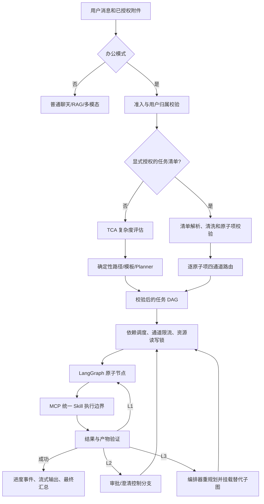
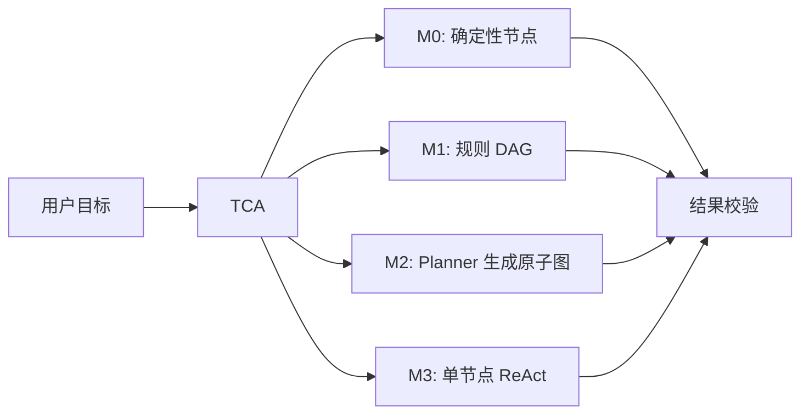
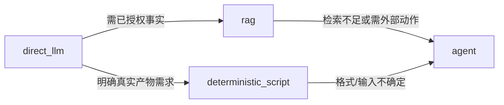
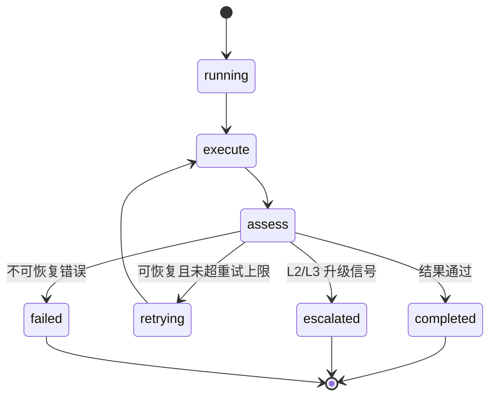

# 当前办公 DAG 架构说明

> 状态：以当前代码和 Docker 默认配置为准  
> 适用范围：办公模式；普通聊天不进入本文所述的 DAG  
> 相关代码：`app/agents/orchestration/`

## 1. 设计边界

Lumi 将普通聊天和办公自动化分成两条链路。

| 模式 | 入口能力 | 是否进入 DAG | 写操作与系统工具 |
| --- | --- | --- | --- |
| 普通聊天 | 对话、已上传文档问答、识图、语音、受控检索 | 否 | 不暴露办公写操作、本地文件、任意 Shell 或项目工具 |
| 办公模式 | 文档处理、产物生成、跨资料核对、外部动作、任务清单 | 是 | 仅在能力、用户、场景和确认校验都通过后执行 |

这里的 DAG 不是一个“锁住环境范围的智能体任务”。它是任务级控制面：将用户的目标拆成原子节点，约束节点依赖、资源访问、并发、审批和恢复。模型只能在一个节点的受限工具空间内推理，不能自行修改任务图。

## 2. 实际运行态

Docker Compose 默认设置：

```text
AGENT_ORCHESTRATION=legacy
AGENT_DYNAMIC_SUBGRAPH_ENABLED=true
```

名称中的 `legacy` 仅表示自建的持久化 asyncio DAG 运行时，不表示旧的手写工具循环。该运行时是当前办公模式主路径，负责：

- 清单批次续跑；
- L2 审批/澄清；
- L3 替代子图挂载；
- Redis 状态快照、限流、资源锁和任务恢复。

Temporal 已作为可灰度的外部运行器：`temporal` 模式只接收无审批、只读、静态的小 DAG，
让 API 进程只负责提交、查询与 SSE；动态 ReAct、写操作、审批和 L3 重规划仍由当前持久化
DAG 运行器负责。`manifest_temporal` 继续专用于滚动清单。这样先消除可证明安全的 API 内执行，
而不把尚未等价迁移的安全语义强行搬过去。

### 2.1 内核与业务适配边界

编排的可复用控制语义位于独立 workspace 包
[`packages/orchestration`](../packages/orchestration/)（分发名
`lumi-orchestration`）。它不反向导入 `app`，并负责：图结构校验和依赖就绪判定、
任务生命周期转换、准入/通道/资源租约协议、两段式副作用日志状态、超时选择、升级
协议与策略规则引擎。

`app/agents/orchestration/` 是适配与业务层：提供 Redis 客户端、运行时配置、状态持久化、
监控、办公 Skills、Worker、审批与模型错误恢复，并把这些实现注入或调用内核协议。因而
新增一条路由策略通常改 `config/agent_policies/` 或业务 Hook；新增存储/Worker 实现不会
改动内核的锁、状态机或 DAG 语义。完整包边界和本地开发命令见
[ORCHESTRATION_KERNEL_PACKAGE.md](ORCHESTRATION_KERNEL_PACKAGE.md)。

## 3. 全链路



任务状态和节点进度会持久化到状态存储。前端的 SSE 断开不会自动取消任务；用户明确取消才会终止运行中的节点并释放任务容量。前端重进会话时应恢复服务器快照，而不是以本地气泡状态判断任务是否结束。

## 3.1 文件上传、授权与任务输入

办公任务不会直接接收客户端本地路径。前端先上传文件，服务端返回用户归属的
`doc_id`，提交任务时只把经过服务端确认的文档引用放进 `office_docs`。

### A. 办公附件（会话级、默认 TTL）

```text
POST /api/v1/office/docs
  multipart: file
        |
        v
create_session(user_id, doc_id)
  -> data/office/{user_id}/{doc_id}/original.*
        |
        +--> read_structure（线程池，解析/OCR/结构预览）
        +--> persist_session_record（Postgres，文件哈希、全文、TTL）
        |
        v
前端保存 {doc_id, filename, kind}
        |
POST /api/v1/agents/jobs
  {
    "scene": "office",
    "request": "...",
    "office_docs": [{"doc_id": "...", "filename": "...", "kind": "..."}]
  }
```

提交时后端重新按用户归属解析会话，规划器只能使用这些显式附件。文件内容里的
“请执行某命令/忽略安全规则”等文本不是授权来源。会话文档可被办公节点读取、分析、
转换或生成产物；默认过期后清理。只有用户调用
`POST /api/v1/office/docs/{doc_id}/promote`，才会复制到长期知识库并进入 Celery 入库链路。

### B. 长期知识库文档（永久、异步入库）

```text
POST /api/v1/knowledge/documents
  multipart: files/file + space_id + category
        |
        v
upload_document_file（保存原文件、SHA-256 去重、status=pending）
        |
        v
DB commit 完成后 Celery process_document 入队
        |
        v
解析 -> 清洗/质量门 -> 分类 -> 类型分块
     -> dense/sparse embedding -> document_chunks/pgvector
        |
        v
status=ready（失败为 failed，并记录 error_message）
```

办公 DAG 不会在提交前隐式扫描长期知识库。只有规划结果显式产生 `retrieval`/
`atomic_step(query_knowledge)` 节点时，才按 scope、用户权限和知识空间检索。

### C. 聊天附件

`POST /api/v1/uploads` 只用于图片、音频、视频等聊天附件，返回签名访问 URL；它们
不会自动进入办公 DAG 的 `office_docs`。需要办公文档处理时，应使用办公附件接口或
明确将文件上传到知识库。

### 输入安全检查

任务提交阶段会校验：用户身份、会话/文档归属、文档是否仍在 TTL 内、文件名匹配、
场景权限、写开关和提交幂等键。找不到唯一文件时返回澄清，不猜测相近附件；重复的
SHA-256 文件复用已有知识库实体，不重复解析和嵌入。

### 多文档定位

当当前任务带有两份及以上已授权附件，且请求是“哪份/是否包含/条款/金额/日期”等
事实定位问题，Planner 不会把附件逐个展开成 DAG 节点，也不会直接交给无范围的 RAG。
它优先生成固定两节点子图：`document_targeting → direct_llm`。前者一次调用
`inspect_document_set` 获取 `doc_id + filename + kind + 摘要 + 页数` 的轻量概览；只在摘要
给出**唯一高置信**候选时才调用 `read_document(doc_id)`，后者仅依据该受限读取结果回答。
因此常见的文件夹事实问答走 `rag`/`direct_llm` 池，不占仅 2 槽的 `agent` 池。

摘要无命中、分数相近或请求本身包含修复、条件分支、外发/写入等动态动作时，才升级到最多
4 轮的 `react_step`。两个 Skill 都只能访问服务器注入的 `office_doc_ids`，调用方提供的 ID
只能缩小范围，不能扩权。选中的文档、候选分数、选择理由写入工具元数据与节点 span；摘要
按文档缓存，不额外调用模型生成。即使上游分类漏检，`retrieval` Worker 在发现两个以上
授权附件时也会执行同一范围收窄，绝不直接无范围检索长期知识库。

## 4. 入口：TCA 与四通道路由

### 4.1 TCA 四级复杂度

`tca.py` 按任务形状而非业务名称评估五项维度：实体数、参数显式度、步骤依赖性、目标模糊度和历史依赖。

| TCA 层级 | 模式 | 适用任务 | 规划成本 |
| --- | --- | --- | --- |
| M0 | 确定性 | 已定位的单文件格式转换、明确小操作 | 无规划 LLM |
| M1 | 规则 DAG | 固定模板、已知流水线 | 零到一次参数提取 |
| M2 | Plan-and-Execute | 可预先列出步骤的多步任务 | 规划、执行、汇总 |
| M3 | 受控 ReAct | 必须依据中间结果改方法的开放任务 | 有界工具循环 |

TCA 的规则命中仍是默认生产路径。规则无法识别或置信度偏低时，规划器可调用一次严格 JSON 的轻量长尾分类器；请求级 BYOK `llm_api_key` 优先，没有则使用统一的办公/全局预设密钥。该调用只返回动作/对象候选，不生成节点，也不能绕过后续安全检查。没有有效密钥、调用失败或 JSON 不合规时，系统保守澄清，不把未知请求伪装成 RAG。

### 4.2 四通道路由

每个原子任务在 `task_routing.py` 选择成本最低的充分通道：

| 通道 | 执行器 | 示例 | 默认并发上限 |
| --- | --- | --- | --- |
| `direct_llm` | 直接内容生成 Worker | 写短文、改写、解释 | 32 |
| `deterministic_script` | 受控脚本/确定性办公 Worker | CSV 转 TXT、批量导出 | 20 |
| `rag` | 已授权资料检索 Worker | 从上传资料找事实并回答 | 12 |
| `agent` | `react_step` 受控 ReAct Worker | 跨工具核对、外部状态动作 | 2 |

路由顺序的重点是“最小充分路径”：直接回答不进入规划；明确格式转换不让模型逐行口述；需要已授权资料才走 RAG；有外部状态、依赖或多能力组合才进入 Agent。

### 4.2.1 实时信息：领域工具优先，通用联网检索兜底

“需要实时信息”不是一个单一能力。DAG/聊天路由先识别**数据领域**，再从已授权的
Skill 目录中选择最窄、最可验证的工具；模型不能用自己的参数或提示词临时创造工具。

| 请求类型 | 首选工具 | 输出契约 | `web_search` 的角色 |
| --- | --- | --- | --- |
| 当前日期/时间 | `get_datetime` | 时区、时间、来源=`system_clock` | 不使用 |
| 当前天气、降雨、预警、空气质量 | `get_weather`（待接入天气供应商） | 城市/坐标、观测/预报时间、更新时间、数据源 | 供应商无对应字段时，仅可补充背景资料，不能替代天气读数 |
| 股票、汇率、行情 | `get_market_quote`（待接入行情供应商） | 标的、市场状态、报价时间、数据源 | 用于新闻/背景，不得替代报价 |
| 路线、地点、地理编码 | `get_route` / `geocode`（待接入地图供应商） | 起终点、更新时间、数据源 | 用于开放资料说明，不得替代路径计算 |
| 新闻、政策、网页调研、开放式资料 | `web_search`（Tavily） | URL、标题、摘录、检索时间 | 主路径 |

当前已实现的通用外部查询是 `web_search`（Tavily），它是受控的只读 Skill，而不是聊天请求的
预处理器。模型只能在工具目录允许的范围内自行调用它：适用于用户明确要求联网/网页来源，或
确实需要核实公开互联网中的新闻、政策和外部事实。**“今天、当前、实时、天气、价格”等词本身
绝不触发后端强制搜索**，因为它们同样可能指向用户的待办、对话、附件或知识库。私有状态、上传
资料、总结、改写、创作和计算也不得用联网工具处理；无法确认时模型应说明边界或澄清，而非猜测
用户意图后联网。

前端的 `web_search=true` 是用户显式提出的联网偏好：后端将该偏好交给受控 ToolNode，但仍由模型
根据本次语义选择是否调用 `web_search`，不会绕过工具门禁直接预搜。默认关闭时，普通聊天同样可在
需要时进入受控 ToolNode；模型未调用工具就直接回答。实际调用结果及 citation 会回流给最终回答。
在 `get_weather` 未接入前，天气网页结果必须声明“来源为网页检索，非权威实时气象数据”，且不把
网页摘录伪装为当前观测值。

后续接入垂直实时 API 时，应将其实现为标准只读 Skill，并通过能力元数据声明
`domain`、JSON 参数 Schema、来源名称、超时、限流和数据新鲜度；路由按领域优先暴露该
Skill，`web_search` 只在它不适用时才是候选。不要通过 YAML 写任意 HTTP 地址、表达式或
供应商密钥；供应商调用与响应校验必须留在受审计的 Python Skill 中。

### 4.3 通用自然语言路由门禁

普通请求在进入四通道前经过以下固定顺序：

1. **指代消解**：只接受唯一附件或有边界的近期上下文；“这个”“也发给李四”等无法唯一定位时保留澄清状态。
2. **动作序列识别**：规则提取 `read/analyze/transform/send/execute` 等通用动作并保留用户顺序，不使用行业实体作为路由条件。
3. **长尾分类（可选）**：规则无动作、动作置信度低或长句缺少动作词时，调用一次小模型 JSON 分类。候选会和规则结果合并，仍必须经过对象、权限、风险和审批门禁。
   当前确定性词表以中文为主；英文或其他语言请求依赖这一层分类，用户 Key 优先、预设 Key 兜底。没有有效模型配置时，多语言复杂请求会进入澄清，而不会猜测执行。
4. **静态 DSL 编译优先**：动作类型已知但参数依赖上一步结果时，编译为带 `input_contract/output_contract` 的 DAG；只有下一步动作类型本身依赖中间结果时才进入 `react_step`。
5. **渐进式安全处理**：置信度低或关键对象缺失则澄清；外发、系统命令和写操作必须带审批信息。模型分类不能把无收件人发送或无目标执行变成可执行任务。

一个原子项如果本身混合了多种能力，例如“读取合同、提取条款、到系统核对合规性”，不应强行归入一个通道。清单清洗器可输出 `subtasks`，随后展平成局部子图：读取/提取/核对/汇总各自成为节点，Agent 只在节点内部做语义判断。

### 4.4 策略资产治理

路由策略不是可执行脚本。`config/agent_policies/` 只能写经 Pydantic 校验的声明式数据；条件
只可读取 `RoutingFeatureSnapshot v1` 中注册的封闭特征，不能包含 Python/Jinja 表达式、动态导入、
正则或 HTTP 地址。特征由 `policy/features.py` 单点计算并声明 owner，Planner、路由和审计消费同一
快照，不能各自重新解释 `docs_count` 或事实定位语义。

加载阶段的 lint 会拒绝未知特征/Hook、类型不匹配、重复 ID、优先级或重叠规则未显式声明的策略。
当前仅**进程启动**加载（不支持热加载）；加载失败产生 `ROUTING_POLICY_LOAD_FAILED` 监控事件并保留
legacy 路由。`shadow` 模式只在内存求值并记录差异，绝不双规划或双执行；达到预设样本量、无安全恶化
且目标差异已人工分类后，才可切到 `enforce`。

## 5. 单任务与清单任务

### 5.1 单任务



Planner 在生成后必须经过静态校验：节点 ID 唯一、依赖存在、无环、Worker 已注册、必需参数完整、资源声明合法。不能执行的规划不会直接投入运行。

当普通办公 DAG 的节点数达到 `AGENT_LOGICAL_PLAN_MIN_NODES` 时，完整计划会外置为逻辑计划，`Job.nodes` 只保留当前依赖已满足的执行前沿。每轮结束后，编排器提交节点状态和不含正文的 `result_ref`，检查预算后再物化下一前沿。下游需要上游内容时，只能在执行时按用户归属和哈希校验读取该引用，不能从 Job 快照获得完整前缀。

这与清单滚动类似，但普通 DAG 的前沿按 Planner 依赖图生成，而不是按清单固定批次生成。L3 重规划只能由编排器替换外置计划中尚未完成的尾部；完成前缀不会重跑。若前缀包含已提交或结果不确定的副作用，自动重规划被阻止。详细协议见 [LOGICAL_PLAN_ROLLING.md](LOGICAL_PLAN_ROLLING.md)。

### 5.2 显式任务清单

任务清单是独立的控制路径，不能把一百项任务一次性交给模型生成脆弱的大 JSON。

1. 仅当用户明确要求“执行/逐项处理”时，才将消息或指定附件当作可执行清单。
2. 若来源是附件，必须由当前用户明确指定文件名；多附件时不猜测。
3. 编号或项目符号清单由确定性解析器保留原顺序。模型清洗结果仅在条数和文本覆盖率均通过时补充依赖和局部子图，不能新增、合并或丢弃任务。
4. 文档中的指令本身不授予执行权限；包含越权、密钥、其他用户数据等控制覆盖内容的条目会被拦截。
5. 清单持久化为 `Job.routing.manifest`，默认每批物化 10 项，执行后再物化下一批，最多 500 项。
6. 每一项独立选择四通道，并保留状态、结果、路由原因和预估 token。最后由 `collect_results` 归集，再生成面向用户的汇报。

显式编号清单默认按书写顺序串行，避免用户认为“第 2 项依赖第 1 项”却被并行执行；自然语言清洗出的、明确无依赖的条目可在通道限流和资源锁允许时并行。

### 5.3 通道升级

通道选择不是一次性决定。清单项发现当前路径能力不足时可受控升级：



升级由调度器根据结构化失败证据安排，不能由 Worker 自己跳过权限、审批或依赖直接改图。

## 6. DAG 执行模型

### 6.1 节点原子性与隔离

一个 `TaskNode` 有一个目标、一组显式依赖和声明的资源读写意图。节点可获取的上游上下文仅来自 `depends_on` 的结果；无依赖的并行节点不共享可变执行上下文。

调度器在每个节点开始前按以下顺序套入边界：

```text
写资源协调预检（Redis）
  -> 全局节点 semaphore
    -> 路由通道 lease
      -> 资源读写锁
        -> LangGraphNodeRunner（节点硬超时）
          -> Worker / Skill / MCP
```

只要前置依赖失败，普通节点会被跳过。显式清单节点可声明“失败后继续”，以便一个失败项不会阻塞不相关的后续清单项。

### 6.2 节点内部运行图

每个节点由 `LangGraphNodeRunner` 承担统一的执行、检查和有限重试语义：



写操作使用两段式副作用日志：工具体开始前先在 **PostgreSQL `effect_journal`** 写只含
`job_id/node_id/tool/params_sha256` 的 `intent`，成功后将同一行更新为 `confirmed`。
工具正文、密钥和完整提示词不复制到 journal；已脱敏的公开结果可随确认记录保存。写入
intent 失败时节点以 `EFFECT_JOURNAL_UNAVAILABLE` fail-closed，工具体绝不启动；工具已执行
但确认写入失败时，原 intent 保留并以不确定状态收敛，绝不自动重试。进程在 intent 与
confirm 之间中断时会留下不可重放的 `EFFECT_UNCERTAIN`，不会自动重试，避免重复发邮件、
重复删除或重复写入。应用启动会把超过
`AGENT_EFFECT_INTENT_RECOVERY_GRACE_SECONDS`（默认 15 分钟）的 intent-only 记录标为
`recovery_orphaned_intent`；新记录不会被恢复扫描误伤。确认请求的
指纹为 `tool + 参数 + 上游 result SHA-256 链`；上游正文或引用变化会使旧审批自动失效。
节点硬超时按通道或工具配置；超时会取消 Worker 协程，节点标记 `NODE_TIMEOUT`，副作用
节点同样不自动重试。

Redis 仍只承担资源协调、任务快照与通道租约，不再承担副作用恢复证据。测试通过显式注入
内存 journal double；生产路径没有 Redis 或进程内存回退。部署前必须执行 Alembic revision
`0010_effect_journal`，否则写节点会安全拒绝运行。

### 6.3 受控 ReAct 与 scratchpad

M3 的 `OfficeReactRunner` 是 LangGraph 受控循环：

```text
agent -> before_tool -> tools -> after_tool -> agent / finish
```

它的消息状态以 `AIMessage(tool_calls)` 和 `ToolMessage` 累积，这就是 ReAct 所需的 `agent_scratchpad` 等价物。模型下一轮能看到自己调用过的工具及观察结果，但该中间信息不直接作为完整思维链暴露给前端。

限制包括：每轮至多一个工具、最多 `max_rounds` 轮、每轮最多展示有限候选工具、失败工具从后续候选中剔除。这样既保留换方法能力，也避免工具循环无限膨胀。

## 7. 失败协议与动态子图

Worker 不能直接扩图，只能返回 `EscalationSignal`。编排器是唯一能暂停、澄清或挂载替代子图的决策者。

| 级别 | 含义 | 节点行为 | 编排器动作 |
| --- | --- | --- | --- |
| L1 工具级 | 脚本错误、瞬时超时、工具返回异常、结果不合格 | 节点内部有限重试、换工具或换参数 | 不改变外层图 |
| L2 任务级 | 需要确认、缺少前提、权限不足、前置条件不成立 | 上报 `level=task` 的结构化信号 | 进入预建审批或澄清分支；恢复同一节点或终止 |
| L3 计划级 | 方法/计划无效、能力缺口、任务理解需重构 | 上报 `level=plan` 的结构化信号 | 按失败证据重新规划、静态校验、挂载替代子图 |

L3 不等于让执行节点“往当前图里插节点”。原图的完成状态和失败证据被保留，编排器生成经过验证的替代子图并记录挂载历史；重规划次数受 `AGENT_SUBGRAPH_MAX_REPLANS` 限制，达到上限后转为明确失败或澄清，避免无限循环。

不自动重规划的典型情况：副作用结果不确定、非可重规划的验证错误、缺少安全上下文、Planner 不支持目标层级。此时系统应给出可操作的用户提示，而不是继续尝试。

## 8. 资源、并发与恢复

### 8.1 资源互斥

节点声明 `ResourceClaim(key, mode)`：

- 同一资源可并发读；
- 写与读、写与写互斥；
- 多资源按稳定键顺序获取，降低死锁风险；
- Redis Lua 脚本维护租约；持有者定期续租；过期读锁和写锁会清理。

Redis 不可用时，**只读**资源可退回当前 API 进程内的 asyncio 锁，保证查询可继续；
**写入**资源不能退化，因为无法证明跨实例所有权。写节点在获取 semaphore、通道 lease、
Worker 和副作用 intent 之前进入 `waiting_resources`，保留原节点并周期性探测 Redis；
恢复后继续调度。无关的只读节点可继续运行。这使 Redis 成为写资源隔离的必需依赖，而不是
可选优化。等待资源的任务立即释放全局/单用户准入槽与心跳，进入挂起池；最长等待
`AGENT_WAITING_RESOURCES_TIMEOUT_SECONDS`（默认 30 分钟）后转 `paused` 并提示用户。恢复 Redis
或用户恢复任务前必须重新获取准入槽，满载则继续挂起而不绕过配额。

### 8.2 准入与限流

| 控制点 | 默认值 | 作用 |
| --- | ---: | --- |
| 提交规划槽 | 8 | 满载时快速背压，避免大量请求同时规划 |
| 全局活动任务 | 32 | 限制服务的办公任务总数 |
| 单用户活动任务 | 2 | 防止一个用户占满资源 |
| 节点并发 | `AGENT_NODE_CONCURRENCY` | 限制单任务 DAG 的就绪节点数 |
| 通道并发 | 32 / 20 / 12 / 2 | 分别限制 direct/script/rag/agent |

### 8.3 运行器灰度

`AGENT_ORCHESTRATION` 的默认值仍是 `legacy`。部署独立 Temporal Worker 后可设为 `temporal`：
只有 1-6 个 `direct_llm`、`retrieval` 或 `web_research` 节点，且没有写资源声明、审批、清单或
逻辑计划的任务才会离开 API 进程。任一条件不满足或 Temporal 不可用时，任务明确记录为
`runtime=legacy` 并走原有运行器；不会把已提交的外部 Worker 任务错误地回退到进程内重复执行。

启动本地 Worker：

```powershell
docker compose -f docker-compose.yml -f docker-compose.temporal.yml --profile temporal up -d
```

要验证滚动清单运行器时，在同一命令前设置
`$env:TEMPORAL_ORCHESTRATION_MODE = "manifest_temporal"`；该 overlay 变量不会被
`.env` 里的默认 `AGENT_ORCHESTRATION=legacy` 覆盖。

动态任务运行器的完全外置仍是后续工作，必须先补齐 L3 动态子图的持久化语义，不能用 Celery
替代，因为 Celery 不承担审批等待和可恢复 DAG 的工作流职责。

任务准入使用 Redis ZSET 租约并有心跳续租。通道 lease 同样有 owner 续租循环；现阶段仍强制
`lease = 节点硬超时 + 60 秒`，使硬超时先于 lease 释放，并作为 Redis 短暂异常时的保守回收上限。
续租失败会取消持有节点；进程死亡则由 TTL 清理。后续重点是补进程死亡与 Redis 短暂中断的端到端压测，
而不是再增加第二套 lease 机制。

### 8.4 取消、暂停、恢复

- 暂停时不调度新的节点；正在运行节点按既有边界收尾。
- 取消/中断时会取消运行节点、标记未运行节点，并执行副作用日志收尾。
- 状态接口先验证任务归属；取消、暂停、恢复和审批都不能跨用户操作。
- 审批身份绑定 `tool + 规范化参数哈希 + 上游结果哈希链`；模型更改参数或上游内容时，必须重新审批。
- `waiting_approval` 与 `waiting_resources` 都不持有节点、通道或任务准入槽；审批默认 24 小时失效，
  失效后节点标记 `APPROVAL_TIMEOUT`、任务失败。批准/恢复前重新申请准入容量。
- ReAct 在第 N 轮触发 L2 审批时立即终止该节点；批准后从节点开头重入，保留已持久化的工具元数据和
  审批指纹，但**不恢复未验证 scratchpad**，避免把旧模型上下文当作已批准输入。

## 9. MCP 与 Skill 边界

所有已注册 Skill 都从统一 MCP Gateway 进入执行：

| 能力位置 | 调用方式 | 用途 |
| --- | --- | --- |
| 服务端/沙箱 Skill | Gateway 内进程适配器 | 文档解析、RAG、业务逻辑、隔离脚本 |
| 用户客户端 Skill | 标准 MCP Streamable HTTP | 打开应用、设备文件、邮件客户端等 |

对客户端 MCP，后端只使用显式配置的服务器和工具。每个工具仍经过：场景白名单、用户角色、参数 Schema、写操作确认、任务归属和结果脱敏。不能因为附件文本、工具输出或提示词要求就临时获得新工具、其他用户数据、服务器路径、环境变量或密钥。

MCP 客户端支持会话复用、工具发现缓存、断路器、超时和 best-effort 取消。客户端工具不能可靠绑定到当前用户设备时，不应做全局发现；应走具名的、用户关联的请求通道或 Redis 客户端工具队列。

### 9.1 工具契约与选择原则

工具不是“让模型自由发挥的 API 集合”，而是带有输入、输出、安全和可观测性契约的原子
能力。每个新工具至少必须定义：

- 参数 Pydantic/JSON Schema，以及允许的地域、标的或资源范围；
- `success`、`error_code`、`retryable`、`source`、`updated_at` 和可展示引用；
- 超时、限流、供应商失败/额度耗尽的错误映射；
- 是否有副作用、资源声明和是否需要审批；
- 对应的单元测试：成功、空结果、超时、额度/鉴权失败，以及“不可用时不由 LLM 伪造结果”。

工具暴露遵循以下优先级：

```text
本地确定性工具
  -> 垂直领域 API（天气/行情/地图等）
    -> 已授权的内部资料/RAG
      -> 通用网页检索
        -> 仅在不宣称实时性时使用模型自身知识
```

这条顺序是能力选择，而不是把每个请求都改成更复杂的 DAG。单个、只读且参数完整的天气
查询仍应是一个原子节点；只有“查询天气 -> 根据降雨决定通知 -> 发送通知”这类后续动作
依赖实时结果时，才需要把工具调用和副作用编译为多个带依赖与审批的 DAG 节点。

## 10. 状态、展示与可观测性

节点状态至少包括 `pending`、`ready`、`running`、`retrying`、`completed`、`failed`、`escalated`、`skipped`、`cancelled` 和 `interrupted`；任务级非终态还包括 `waiting_approval` 与 `waiting_resources`。前端只显示已完成或进行中的原子步骤，完成后折叠；服务器快照短暂不可读时以省略号步骤兜底，不把它误显示为任务结束。

应按 Job、节点和工具 span 记录：

- 路由与 TCA 命中层级；
- 规划、排队、资源等待、LLM、工具和验证各自耗时；
- 输入/输出 token、通道升级、重规划、审批和取消；
- 工具成功率、失败类别、MCP 连接/熔断/超时；
- 实时工具的供应商、数据更新时间、缓存命中、过期数据拒绝和配额/鉴权失败；
- 产物验证、幂等命中和不确定副作用。

仅记录最终回答不足以定位多步骤问题。尤其是“任务很慢”必须分辨模型调用、队列、资源锁、MCP 网络、沙箱启动还是文档解析在耗时。

### 10.1 从节点结果到前端输出

执行完成后，输出有三种形态，前端不能只读取 `Job.nodes` 的数量来判断任务是否结束：

| 输出 | 产生位置 | 前端读取方式 |
| --- | --- | --- |
| 文本回答 | `job.result.final_answer`，无汇总模型时由节点 `content/output` 拼接 | 聊天 SSE `done.content`，或 `GET /api/v1/agents/jobs/{job_id}` |
| 节点过程 | 每个 `TaskNode` 的状态、工具、耗时、公开输出和错误 | SSE `job`/`step`/`delta` 事件，或任务查询接口的 `nodes` |
| 文件产物 | 节点结果的 `outputs` 引用，实际文件写入用户隔离的办公输出目录 | `/api/v1/office/docs/{doc_id}/outputs` 或 `/api/v1/office/docs/outputs?conv_id={job_id}`，再下载/预览 |

典型聊天 SSE 顺序如下：

```text
job      {job_id}
  -> step   节点 pending/running/completed（可重复更新）
  -> delta  文本技能产生的增量（可选）
  -> step   最终节点状态
  -> done   {content, citations, steps, scene}
```

SSE 只是展示通道。连接断开时任务继续在后台运行；前端重连后应通过任务 ID 查询
服务器快照。`done` 事件之后不再追加错误事件，后台持久化、通知和记忆索引失败只写
监控日志，不覆盖已经生成的成功回答。

任务结束时的汇总规则：

1. 有 `job.result.final_answer` 时优先使用它；
2. 没有汇总答案但存在节点输出时，按节点结果拼接；
3. 节点全部失败或任务进入规划错误/澄清状态时，返回可操作的错误或澄清问题；
4. 引用信息从节点结果的 `tool_metadata.citations` 汇总，不把未授权原文放进任务快照；
5. 产物下载必须再次校验用户归属、任务/文档 ID 和安全文件名，不能接受客户端任意路径。

逻辑计划场景下，`Job.nodes` 只代表当前执行前沿；前沿完成后会被提交到外置逻辑计划，
下一批节点替换进窗口。因此完整计划的节点总数应查看 `routing.logical_plan.progress`，
而不是把当前窗口误显示为完整或失败的任务图。

## 11. 执行谱系、观测与分支回放

每个任务同时是一个独立执行：普通任务的 `execution_id` 等于 `job_id`；从历史任务重做时会创建新的 Job/执行，不覆盖原任务。分支携带 `parent_execution_id`、`root_execution_id` 和 `forked_from_node_id`，用于在任务面板和运维侧对照执行过程。

分支采用“前缀引用”而不是复制结果正文：已成功且未被重做的前序节点只保留 `{id, sha256}` 结果引用。正文保存在按用户隔离的结果仓，只有真正依赖它的下游节点运行时才解析，且会验证所有者和哈希。结果引用至少保留 `max(AGENT_JOBS_TTL_SECONDS, AGENT_RESULT_REF_TTL_SECONDS)`（默认 7 天）；缺失、过期、所有者不匹配或哈希不匹配会使依赖节点得到 `RESULT_REF_EXPIRED` 与“前序结果引用不可用，需重新执行”的受控提示，绝不静默把缺失引用当为空上下文。这样不会把模型回答、文档内容或工具输出放进新 Job 快照、常规 API 或未来的 Temporal history。

节点开始/结束会写入紧凑 span，供 `GET /agents/jobs/{job_id}/spans` 查询。span 只含节点、事件、状态、公开工具名、参数哈希、结果引用、错误码和副作用状态，不含完整 prompt、模型正文、工具原始输出或密钥。它用于排障与分支对照，不是思维链展示。

v1 的回放是前向重做：如果用户所选节点的依赖前缀或该节点本身已有 `effect_status=committed`，系统拒绝创建分支。已发送邮件、已写文件等外部效果不会因为回放自动撤销；补偿必须作为独立、可审批的工作流实现。滚动清单（包括 `manifest_temporal`）因历史节点已压缩，暂不支持单节点分支。详细协议见 `docs/EXECUTION_FORK_REPLAY.md`。

## 12. 当前已知限制与优化建议

以下是已实现架构之外，建议优先审阅和优化的项目。

| 优先级 | 问题 | 影响 | 建议 |
| --- | --- | --- | --- |
| P0 | 动态 DAG 仍在 API 进程中运行 | 静态只读 DAG 已可交给独立 Temporal Worker；含 ReAct、写、审批或 L3 的运行中协程仍无法被其他实例接管 | 补齐 Temporal 的动态子图持久化后再迁移，不能用 Celery 代替工作流 |
| P0 | 进程死亡的预发布 lease 演练尚缺 | 内核已覆盖续租失败取消持有节点；真实 Redis TTL 回收仍需容器级证据 | 在预发布环境杀掉持锁 Worker，等待 TTL，验证后继节点不会与旧节点重叠执行 |
| P0 | 副作用 journal 的恢复故障演练尚缺 | journal 已落 PostgreSQL 并 fail-closed，但尚未做真实容器 kill/restart 演练 | 在预发布环境制造 intent-only 记录与数据库短断，确认扫描标记不确定且写工具不重放 |
| P0 | 多文档覆盖策略需预发布样本校准 | 固定路径已对弱相关次高候选做受限二次读取，接近候选升级 ReAct | 用真实附件集观察二次核验比例、错误澄清率和 citation 可解释性，再调整阈值 |
| P0 | 任务清单的“继续失败项”语义需按业务确认 | 无关项继续是合理的，但错误依赖标注可能产生误执行 | 在 UI 展示依赖图与继续策略；对写操作失败后的后续节点提高确认门槛 |
| P1 | TCA 主要为规则 | 边界表达可能误分类，尤其是含糊、混合任务 | 增加带离线评估集的轻量分类器/向量候选，并保留规则的高置信旁路 |
| P1 | 计划缓存/经验沉淀尚未形成完整闭环 | 高频任务不会自动固化成 M0/M1 | 仅缓存已验证成功且无敏感上下文的参数化计划；基于命中率、失败率、延迟做灰度提升 |
| P1 | 动态子图的版本与审计可再增强 | 重规划后排障需要更多关联信息 | 将原图版本、替代图版本、失败证据摘要和验证结果统一为 DAG revision event |
| P1 | 实时数据仍主要依赖 Tavily | 天气/行情等垂直数据可能陈旧、结构不完整，网页检索不适合承担权威数值读取 | 按领域接入受控只读 Skill（先天气，再按产品需求接行情/地图），要求 `source + updated_at`，供应商不可用时 fail-closed。 |
| P2 | 资源锁依赖资源声明质量 | 漏声明资源会绕过互斥 | 为写类 Skill 提供强制资源模板并在静态校验中拒绝缺少资源声明的写节点 |
| P2 | MCP 取消属于 best effort | 底层桌面应用不支持 `AbortSignal` 时动作仍可能继续 | 客户端工具实现可取消句柄，长操作提供查询/补偿动作 |
| P2 | 编号清单默认串行 | 安全但会降低独立任务的吞吐 | 让用户或清单清洗器显式标记独立项，经过依赖审查后有限并行 |

### 12.1 已记录的下一步

以下事项按依赖顺序推进。当前 `temporal` 灰度只覆盖无审批的静态只读 DAG；在每项
验收前，不扩大它的候选范围，也不将办公 DAG 改投 Celery。

| 阶段 | 事项 | 验收条件 |
| --- | --- | --- |
| 上线前 | 静态 Temporal Worker 灰度与可观测性 | 以 `temporal_static` 完成只读摘要/检索任务；Worker 不可达时，新任务明确回退 `legacy`，已提交任务的控制请求明确报未送达且不重复执行；监控能按 runtime、节点超时、`EFFECT_UNCERTAIN` 查看数量。 |
| 上线前 | 多文档办公冒烟 | 唯一摘要命中时生成 `document_targeting → direct_llm`，不占 agent 池；歧义时才升级最多 4 轮 ReAct。两条路径都先 `inspect_document_set`，只读授权范围，span 有 `document_selection`，回答含可验证 citation。 |
| 上线前 | 前端任务图窗口语义 | 普通计划在提交时仍不超过 `AGENT_PLAN_MAX_NODES`；逻辑计划/长清单只展示当前执行窗口与总进度，提供翻页或摘要，不把数百个事项一次渲染成 DAG 节点。 |
| P0 | Lease 进程死亡演练 | 内核回归已验证 owner 续租失败取消；预发布杀掉持锁 Worker 后等待 TTL，验证后继节点不与旧节点重叠执行。 |
| P0 | Effect journal 恢复演练 | 制造 intent-only 记录后重启 API/Worker；超过 grace 的记录必须转 `EFFECT_UNCERTAIN`，Redis 不可用时写工具必须在工具体前失败。 |
| P0 | 多文档覆盖阈值校准 | 固定路径对弱相关次高候选二次读取、接近候选升级 ReAct；用真实附件集观察误澄清率与 citation 可解释性。 |
| P0 | 挂起任务容量回归 | `waiting_resources` 30 分钟后暂停、`waiting_approval` 24 小时后失败；两者均释放准入槽，恢复前重新申请并遵守全局/单用户上限。 |
| P1 | 动态 DAG 外置前置能力 | 将 L3 替代子图、审批等待、写操作的状态和 effect journal 以可恢复方式持久化到 Temporal；完成故障恢复、审批失效、重规划三类端到端用例后，才迁移动态任务。 |
| P1 | 路由与检索真实评测 | 固化口语化复合意图、多文档、指代消解的回归 fixture；建立内部标注集后再决定 sparse 召回、reranker 阈值和检索漏斗大小。 |
| P1 | 垂直实时工具首批落地 | 接入 `get_weather` 并覆盖成功、空数据、过期数据、限流/额度耗尽和供应商宕机用例；“当前天气”优先命中该工具，Tavily 只用于天气资讯或背景资料。 |
| P2 | 清单吞吐与失败策略产品化 | UI 显示依赖、并行度和失败后继续策略；只允许经依赖审查的独立只读项并行，写操作失败的后续步骤默认要求确认。 |

## 13. 审阅清单

在继续优化前，建议先确认这些产品与运维决策：

1. 是否接受办公任务运行器继续驻留 API 进程，还是要优先拆为独立 Worker？
2. 哪些写操作必须声明资源键，哪些可以安全并行？
3. 清单任务失败后，默认是继续无依赖项、全部停止，还是按动作类型区分？
4. 单次清单的 token、时长、产物数量和并发预算分别应设多少？
5. 客户端 MCP 的用户设备绑定、授权时长和取消补偿策略是什么？
6. 哪些高频成功任务值得固化为 M0/M1，且如何建立离线回归集防止规则误伤？

## 14. 关键入口与验证

| 主题 | 入口 |
| --- | --- |
| 提交、任务控制、L2/L3 编排 | `app/agents/orchestration/orchestrator.py` |
| 依赖调度、节点隔离与副作用日志 | `app/agents/orchestration/dag.py` |
| PostgreSQL 副作用日志仓储与迁移 | `app/repositories/effect_journal_repository.py`、`alembic/versions/0010_effect_journal.py` |
| TCA | `app/agents/orchestration/tca.py` |
| 任务清单与四通道路由 | `app/agents/orchestration/task_manifest.py`、`task_routing.py` |
| 失败升级协议 | `app/agents/orchestration/escalation.py` |
| 执行谱系、结果引用与节点 span | `execution_lineage.py`、`orchestrator.py::fork_job` |
| 准入、通道限流、资源锁 | `admission.py`、`channel_limits.py`、`resources.py` |
| 统一 Skill/MCP Gateway | `app/agents/skills/executor.py`、`app/agents/mcp/manager.py` |

```powershell
# 编排、清单、失败升级与资源控制
.\.venv\Scripts\python.exe -m pytest -q tests\test_orchestration.py

# Skill、ReAct、MCP 与场景边界
.\.venv\Scripts\python.exe -m pytest -q tests\test_skills.py tests\test_skill_recovery.py tests\test_react_runner.py tests\test_mcp_manager.py tests\test_scene_boundaries.py

# 执行分支、结果引用与脱敏观测
.\.venv\Scripts\python.exe -m pytest -q tests\test_execution_lineage.py
```

旧的 `docs/AGENT_ORCHESTRATION_MCP.md` 仍可作为协议与排障参考，但其中“Temporal 为办公主运行时”的描述不再代表当前 Docker 默认运行态。本文件应作为当前架构审阅的起点。
