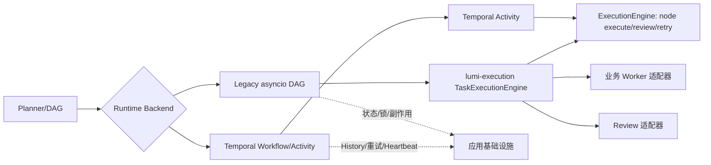

# 编排引擎与执行引擎拆分

项目现在将“任务如何调度”和“单个节点如何执行”分成两个包：

```text
packages/orchestration  lumi-orchestration
  DAG 模型与校验、生命周期、资源/副作用协议、路由策略

packages/execution     lumi-execution
  节点 execute → review → retry/recovery，以及完整 JobSpec 的 DAG 收敛
  policy/retry/resources/effects/artifacts/telemetry：通用执行策略、资源隔离、
  幂等保护、产物边界与遥测协议
```

## 运行时关系

Legacy 和 Temporal 都是编排运行时。Legacy 使用任务级执行内核；Temporal
Workflow 保持确定性状态推进，并通过 Activity 使用同一节点执行语义：



`lumi-execution` 不依赖 FastAPI、Redis、Temporal、LangGraph 或具体
Skill。它的 `TaskExecutionEngine` 接收不可变 `JobSpec` 后负责 DAG
校验、依赖推进、有界并发、失败隔离、暂停/取消轮询、断点续跑及最终
`JobExecutionResult` 聚合；返回的是已完成节点的结构化输出，而非运行时
任务句柄。`ExecutionEngine` 则负责单节点的超时、Worker 调用、质检、有限
重试和恢复决策。

通用能力按模块收束在执行包：`RetryBudget` 负责重试上限与退避计算，
`ResourceDispatcher` 隔离 IO/CPU/外部依赖并发，`EffectGuard` 提供
`intent → confirm` 端口，`ArtifactRef` 约束大产物不进入状态历史，
`TelemetryPort` 统一节点耗时和重试指标。应用层仅实现这些端口，不再复制
执行语义。

应用层的 `ApplicationTaskExecutionService` 是适配边界：它把 Worker、SSE、
Redis 资源租约、PostgreSQL effect-journal 与审批状态接入执行包。这样业务
层只提供基础设施和领域实现，不再持有另一份通用 DAG 调度规则。

节点执行时，工具调用仍保持单次、串行的请求语义；并发来自无依赖节点而不是
一次模型响应中的多个 function call。执行器在真实 `call_skill` 或 MCP 请求的
临界区取得 `job_id + tool_name` 写租约：同一 Job 的两个节点不能同时调用同一
工具，不同工具则不共享该锁，仍可在节点并发窗口内执行。租约由 Redis 续期；
协调服务不可用时受影响调用失败关闭并返回可重试错误，避免跨进程重复驱动工具。

## Legacy 接入

Legacy asyncio 与 Temporal 是运行时差异，不再拥有各自的通用 DAG 调度循环。
Legacy Job 直接进入 `ApplicationTaskExecutionService`，由
`TaskExecutionEngine` 驱动至 completed、failed、paused、cancelled、
waiting_approval 或 waiting_resources，并返回已执行节点的聚合结果。
四级路由仍只选择 `direct/script/RAG/Agent` 和运行时 Backend，不需要了解
执行引擎实现。正在执行的历史任务不迁移；新提交任务使用统一执行内核。

## 迁移边界

- DAG 依赖、节点并发、暂停/取消、失败隔离、恢复快照和结果聚合由执行包负责。
- 资源锁、effect-journal、审批、状态持久化和 SSE 仍由应用适配器负责。
- 副作用仍必须在执行前由调用方写入 `intent`，成功后写入 `confirm`；执行包
  不会绕过幂等和权限控制。

新增执行策略时只需扩展 `lumi-execution` 的端口或策略适配器；新增运行时
 时实现现有 Backend 契约即可，不需要复制业务 Worker 代码。

## 运行时后端模块

运行时后端按部署语义拆分，避免把 Legacy、静态 Temporal、逻辑计划和清单
控制逻辑长期堆在一个文件中：

```text
app/agents/orchestration/backends/
  contracts.py                ExecutionBackend 与 BackendControlResult
  legacy.py                   进程内任务执行服务适配
  temporal_manifest.py        授权清单工作流
  temporal_static.py          静态 DAG 工作流
  temporal_logical_read.py    纯读逻辑计划工作流
  temporal_logical_effects.py 预声明审批副作用工作流
```

业务协调器直接从上述 Backend 模块导入类型；`execution_backend.py` 已删除。
新增运行时应新增独立 Backend 模块；不应重新引入聚合转发模块。

## 业务层协调器

`app/agents/orchestration/job_coordinator.py` 提供
`JobOperationsCoordinator`，统一暴露提交、暂停、恢复、取消、审批和
生命周期回调。原有 `JobSubmissionService`、`JobControlService` 与
`JobLifecycleService` 暂时保留为内部适配器，既减少 `AgentOrchestrator`
的直接依赖，也保持旧扩展和测试的兼容性。后续可按模块边界逐步合并或
替换这些适配器，而不影响执行包和运行时。

## 规划包拆分（2026-09-02）

规划职责已按“契约—策略—编译—应用适配”拆分到
`app/agents/orchestration/planning`。Planner/TaskTree、不可变上下文、
原子节点规范化、提示词、模板策略、静态路由、只读 DAG、办公组合计划和
提交前编译各自位于独立模块。根目录规划兼容入口已删除，所有调用方直接
使用 `planning.*`。清单和逻辑计划的通用游标、进度、前沿
选择及补图校验继续由 `lumi-orchestration` 内核提供；Redis/Temporal、
权限和模型调用仍由应用适配层负责。

## 业务层脚本收束审计（2026-09-02）

本次按 AST 导入图和运行时注册点审计了 `app/agents/orchestration` 下的模块，
没有发现可以安全删除的生产模块：低引用模块仍可能由 Temporal Worker、动态
入口或兼容导出加载。已完成的收束如下：

| 处理 | 结果 |
| --- | --- |
| 节点超时解析 | 从独立 `node_timeouts.py` 迁入 `policy/runtime.py`，Legacy 与 Temporal 共用同一设置适配器 |
| 副作用保护 | Temporal Activity 与 Legacy 节点统一使用 `lumi_execution.EffectGuard`；应用层只保留 PostgreSQL 端口适配 |
| 执行入口 | `execution/` 直接承载服务、节点、生命周期、遥测和校验；`execution_adapter.py`、`execution_backend.py`、`dag.py`、`langgraph_runner.py` 均已删除 |
| 业务适配 | Worker、SSE、Redis 租约、PostgreSQL、Temporal 注册仍留在应用层，不能迁入无业务依赖的执行包 |

因此当前脚本数量主要来自领域服务和基础设施适配，而不是重复执行引擎。
后续删除模块必须同时满足：无生产/测试导入、无字符串注册、无公共兼容导出，
并在删除后完成全量编排与 Temporal 回归测试。
