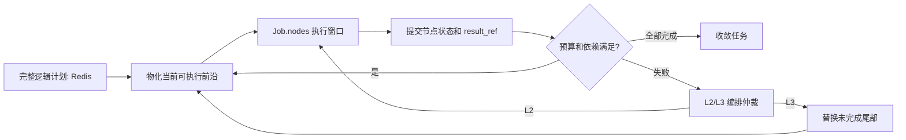

# 普通 DAG 的逻辑计划与滚动物化

## 目的

复杂办公任务不再把完整任务图长期放进 `Job.nodes`。完整逻辑计划外置到 Redis，`Job.nodes` 只表示当前可执行的前沿窗口。这样大图的状态大小、SSE 快照和未来 Temporal history 都不会随总节点数线性膨胀。

默认仍为：

```text
AGENT_ORCHESTRATION=legacy
```

本机制不改变当前 Docker 默认的持久化 DAG 路径；Temporal 仍只是静态只读任务的可选灰度运行时。

## 数据边界

| 位置 | 保存内容 | 不保存内容 |
| --- | --- | --- |
| `Job.nodes` | 当前前沿的节点定义、运行状态、显示元数据 | 整个逻辑图、已完成前缀的结果正文 |
| 外置逻辑计划 | 节点定义、依赖、状态、预算、`result_ref`、少量重规划历史 | 节点结果正文、完整 prompt、模型原始输出、密钥 |
| 结果存储 | 经清洗的结果正文 | 跨用户可读的结果、密钥和敏感字段 |

`result_ref` 固定为：

```json
{"id": "opaque-id", "sha256": "content-hash"}
```

下游节点在执行时才通过用户归属和哈希校验解析引用。引用无效时得到的是受控的“前序结果不可用”提示，而不是其他用户或服务端数据。

## 执行流程



创建计划时会估算每个节点的 token。每次物化前检查：

```text
已用预算 + 已预留预算 + 新节点预估 <= 任务预算
```

预算不足时不会将未执行节点放入 `Job.nodes`。

## 与任务清单滚动的区别

| 项目 | 显式任务清单 | 普通复杂 DAG |
| --- | --- | --- |
| 逻辑来源 | 用户明确要求逐项执行 | Planner 产生的任务图 |
| 外置状态 | `Job.routing.manifest` | Redis 中的逻辑计划 ID |
| 前沿 | 固定批次或清单依赖 | 所有依赖已提交的 DAG 前沿 |
| 完成后汇总 | `collect_results` | 普通 DAG 最终汇总路径 |
| 动态修改 | 清单单项通道升级 | L3 替换尚未物化的尾部 |

两者都只让当前窗口进入实际执行器，但清单保留用户原始条目语义，普通 DAG 保留 Planner 的依赖图语义。

## 失败与动态演进

- L1：节点内部 LangGraph 重试、换工具或换参数，不改变外层计划。
- L2：审批或澄清。审批等待时恢复原来的已物化节点，不改逻辑计划。
- L3：编排器基于完成证据和失败证据重新规划。新计划必须通过原子化、安全补齐和 DAG 静态校验，之后才替换外置计划的未完成尾部。

Worker 只能上报结构化 `EscalationSignal`，不能直接插入或删除外层节点。

已完成节点绝不重跑。若完成前缀包含 `committed` 或 `uncertain` 的副作用，系统禁止自动 L3 重规划，避免重放邮件、删除、写入等不可逆操作。此类任务必须转为明确失败、澄清或后续人工补偿。

## Temporal 迁移约束

未来迁移到 Temporal 时，Workflow input 和 event history 只传递：

- `plan_id`、`execution_id` 和前沿游标；
- 节点状态和 `result_ref`；
- 预算、revision、审批和重规划控制信息。

不得将结果正文、完整 prompt、工具原始输出、BYOK 密钥或敏感上下文写入 Workflow input 或 history。每轮物化、提交、预算检查和尾部替换均应放在 Activity 边界内，保持 Workflow 代码的确定性。
