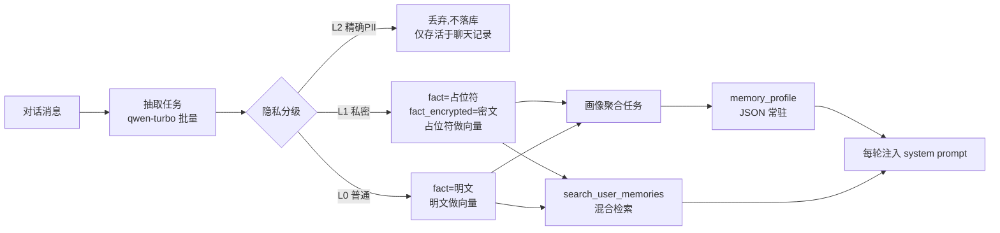

# Lumi 长期记忆系统设计（Memory Design）

> 版本：v1.1（2026-08-21）
> 关联模块：编排器（orchestrator）、Celery worker、pgvector、Redis、control_logs

## 1. 目标与范围

### 1.1 目标

- 从日常对话中自动抽取用户的可复用信息（背景、偏好、经历、目标），形成"画像 + 事实库"两级长期记忆；
- 在对话中按需注入记忆，让模型"记得住用户"；
- 对隐私信息做分级处理：**精确定位个人的 PII 一律不进入记忆库**，只存活于聊天记录并随其生命周期销毁；
- 用户可在设置页查看、检索、删除或清空自己的长期记忆；管理员不可查看私密明文。

### 1.2 非目标（v1 不做）

- 不做多用户记忆共享/社交记忆；
- 不做基于记忆的主动推送（如"记得你生日"的主动提醒，后续可扩展）；
- 不做语音/图片记忆（与 RAG 图片检索一起留待后期）。

### 1.3 决策记录

| # | 决策 | 理由 |
|---|------|------|
| D1 | 记忆只属于注册用户；游客无记忆 | 游客数据前后端均不落库，且游客身份无归属 |
| D2 | 精确 PII（身份证/手机/邮箱/银行卡/精确住址）不抽取、不入库、不进向量 | 消除密文与向量的双重泄露面，比加密更强 |
| D3 | 私密但非精确定位的信息（健康/财务/家庭等）加密落库，用占位符做向量与注入，用户明确请求才解密并审计 | 平衡"可用性"与"隐私" |
| D4 | 用户可管理自己的长期事实；admin 不可见，superadmin 仅用于排障 | 用户提供记忆纠错与遗忘通道，同时保留权限边界 |
| D5 | 画像 + 事实库两级结构 | 画像常驻注入（便宜稳定），事实按需 RAG 召回（精确） |
| D6 | 服务端原文按 token 热窗口淘汰；聊天窗口与服务端存储分离 | 达到 25 万 token 后先生成 L1/L2，再淘汰最早原文；客户端本地历史独立留存 |

### 1.4 会话内分层记忆（v1.1）

长期画像解决“用户是什么样的人”，但不能替代一晚长聊中的细节回忆。普通聊天新增以下层次：

```text
L0 messages                 服务端热窗口原文，淘汰前的唯一事实来源，不直接全量注入
L1 conversation_segments    每 8 轮摘要、实体、未决话题、会话氛围和原文 ID 引用
L2 conversation_memory_states 约 300 token 总摘要、当前 open loops、游标
```

每次已持久化消息后，由 Celery 异步任务维护 L1/L2。读取时固定使用“近期原文 + L2 总摘要”；
仅在用户明确提及过去（如“上次”“那个”“还记得”）时检索 L1。思考档可额外回捞最多 4 条 L0 原文，
快速档不回捞原文。摘要任务位于 SSE `done` 之后，不允许影响首 token 或完成事件。

### 1.5 办公模式：任务状态与近期索引

办公模式不写入长期情节/语义记忆。正在执行的事实只能来自 `Job`、DAG 节点结果、审批记录和产物；
它们不可被聊天摘要或画像覆盖。任务完成后，系统异步写入 `office_task_indices`，仅包含用户 ID、
请求/结果的短摘要、已验证输入文件标识、产物名称和结果引用哈希。该索引不是第二份任务状态，也不存
工具转录、文件正文、磁盘路径或密钥。

- **读取条件**：只在“上次/之前/那个/再给我/继续处理/下载”等显式回指时查询；新任务绝不默认注入旧任务。
- **准确性**：查询严格按用户隔离；候选相近时要求用户确认任务或文件名，不允许模型猜测。
- **产物**：索引只保留 `{job_id, name}` 等引用；下载前仍由产物服务按当前用户和真实文件存在性校验。生成文件过期后，索引保留审计线索但不能伪造下载结果。
- **普通模式单向偏好**：办公模式可读取聊天画像中经白名单过滤的语言、表格、Markdown、文风等展示偏好，且仅传给最终回复格式化器。身份、目标、情节、文件和任何操作性文字一律不跨场景；偏好不能改变文件选择、节点参数、工具、审批或权限。

## 2. 总体架构

### 2.1 两级记忆



### 2.2 核心数据流

1. 用户发送消息 → 正常对话流程（短期记忆不变）；
2. 对话触发摘要时，同步把本段对话批量提交给 `extract_memories` 任务（Celery）；
3. 抽取任务调用 qwen-turbo 输出结构化事实 JSON → 隐私分级 → 去重/合并/矛盾处理 → 写入 `memories`；
4. 每轮对话：编排器注入"画像（常驻） + 按需召回 top-K 事实（占位符）"；
5. 若用户明确请求某条 L1 隐私且策略允许 → 解密该条并注入明文，同时写 `control_logs` 审计；
6. 周期性任务：聚合画像、清理过期/被取代事实、强化高频记忆。

## 3. 隐私分级（核心）

### 3.1 分级定义

| 级别 | 定义 | 示例 | 抽取 | 存储 | 向量化 | 注入 | 解密 |
|------|------|------|------|------|--------|------|------|
| L0 普通 | 不指向个人的偏好/背景/经历 | 喜欢咖啡、在互联网行业工作、养了一只猫 | 抽取 | 明文 `fact` | 原文 | 直接注入 | 无需 |
| L1 私密 | 私密但单条不足以精确定位 | 健康情况、财务状况、家庭矛盾、心理状态 | 抽取 | 密文 `fact_encrypted` + 占位符 `fact` | 仅占位符 | 仅占位符 | 用户明确请求 + 策略允许，审计 |
| L2 精确 PII | 可直接定位到个人 | 身份证号、手机号、邮箱、银行卡、精确门牌住址 | **不抽取** | 不落库 | 不向量化 | 不注入 | 无 |

> L2 数据只存在于原始聊天消息中，依赖聊天记录的生命周期销毁（见 §8.3）。

### 3.2 分级识别

抽取时双重判定：

1. **LLM 判定**：抽取 prompt 强制要求输出 `privacy` 字段（`normal / sensitive / pii`），并给出判定说明；
2. **正则兜底**：命中以下模式直接标记为 `pii`（L2）并丢弃：

```python
PII_PATTERNS = {
    "phone":  r"(?<!\d)1[3-9]\d{9}(?!\d)",          # 大陆手机号
    "id_card": r"(?<!\d)\d{17}[\dXx](?!\d)",          # 18 位身份证
    "email":  r"[A-Za-z0-9._%+-]+@[A-Za-z0-9.-]+\.[A-Za-z]{2,}",
    "bank_card": r"(?<!\d)\d{16,19}(?!\d)",
}
```

命中 L2 的事实直接丢弃（可记录一条不含明文的日志：`detected pii type=phone`）。

### 3.3 加密方案

- 算法：AES-256-GCM（`cryptography` 包，已是依赖）；
- 主密钥：`MEMORY_ENCRYPTION_KEY`（base64 编码的 32 字节随机值），仅存于 `.env` / Docker secret，**不落数据库、不进日志**；
- 每用户派生密钥：`HKDF-SHA256(master, info=b"lumi-memory:" + user_id)`，即使主密钥泄露也需要用户 ID 才能解密，且单用户密钥泄露不影响全库；
- 每条记录：12 字节随机 nonce，存储格式 `base64(nonce || ciphertext || tag)`；
- 字段 `key_version` 记录密钥版本，支持轮换。

新增 `app/core/crypto.py`：

```python
def encrypt_memory_text(plaintext: str, user_id: str) -> tuple[str, int]:
    """返回 (base64_blob, key_version)."""

def decrypt_memory_text(blob: str, user_id: str, key_version: int) -> str:
    """解密；失败抛 MemoryDecryptError（不吞异常，避免脏数据静默）. """
```

#### 3.3.1 密钥管理（具体实现）

- **生成**：`openssl rand -base64 32`，32 字节随机值；
- **存储**：`.env`（已 gitignore，确认不入 git）；Docker 部署走容器环境变量即可（单机 Docker Desktop 用 env 足够；迁移多机/托管环境时再升级 Docker secret 或托管 KMS）；
- **密钥来源抽象（v1 用 env，KMS / Vault 作为可选扩展点）**：`crypto.py` 只依赖 `_master_key()` 一个入口读取主密钥；v1 默认从 `MEMORY_ENCRYPTION_KEY`（.env）读取，用"env + HKDF 每用户派生 + 轮换流程"达到防护。若日后接入 AWS KMS / HashiCorp Vault，只需替换 `_master_key()` 的实现（如 KMS 信封加密解密），对外接口与存储格式不变，不阻塞 v1；
- **轮换（触发式，不做定期轮换）**：
  1. 生成新密钥写入配置，`MEMORY_ENCRYPTION_KEY_VERSION + 1`；
  2. 后台任务 `reencrypt_memories()` 全量重加密（旧密钥解密 → 新密钥重加密 → 更新 `key_version`）；
  3. 旧密钥保留 30 天宽限期（供重加密中途失败的记录回退），之后删除；
  4. 触发条件：怀疑泄露 / 每 12 个月 / 运维变更。单人系统定期高频轮换反而增加数据丢失风险；
- 每用户派生保留：即使单用户密钥泄露也不影响全库。

### 3.4 解密策略与审计

- L1 默认只注入占位符；
- 当用户本轮消息**明确要求**调取该隐私项（由编排器做意图判断：关键词 + LLM 二次确认）时，才解密注入；
- 健康类默认永不自动解密（白名单外）；
- 每次解密注入，在 `control_logs` 写一条审计（沿用现有字段 `user_id / action / target / success / detail / created_at`）：
  `action="memory_decrypt", target=memory_id`，`detail` 为 JSON：

  ```json
  {
    "conversation_id": "...",
    "message_id": "...",
    "request_hash": "sha256(用户请求原文)",
    "policy": "user_request",
    "memory_type": "privacy",
    "data_hash": "sha256(解密明文)",
    "decrypted_at": "ISO8601"
  }
  ```

- 审计日志只存哈希不存明文，保证日志泄露也不带出隐私内容；
- Redis 缓存中**只允许出现占位符与画像摘要，绝不允许 L1 明文**。

### 3.5 L1 占位符设计与检索验证

占位符向量匹配的是"话题类别"而非原文语义，粒度是核心权衡：

- 太粗（"健康类隐私 1 条"）→ 具体查询（"我血糖偏高怎么办"）召不回；
- 太细（复述具体内容）→ 泄露量变大，失去占位意义。

设计：占位符 = `[L1][话题标签] 脱敏描述`，话题标签取自固定词表（健康/财务/家庭/社交/出行/习惯），抽取时由 LLM 打标签：

```text
fact_indexable: "[L1][健康] 用户的血糖监测与饮食建议"
```

- 向量化与关键词检索都以 `fact_indexable` 为对象，话题标签保证"查询话题 → 隐私类别"的可召回性；
- 画像常驻区额外列出隐私话题标签清单（如"隐私项：健康、财务"），即使向量召不回，模型也知晓类别，可主动询问用户；
- **检索验证（开发阶段）**：在隔离测试环境构造“隐私事实 → 话题查询”用例（如“我最近血糖偏高” → 期望召回 `[L1][健康]`），统计 recall@1/3/5，验证占位符粒度不影响召回；
- 说明：`importance / access_count` 等"对抗遗忘"指标由检索命中驱动，不依赖 embedding 相似度绝对值，占位符不影响该逻辑。

## 4. 数据模型

### 4.1 `memories` 表扩展（在现有表上 ALTER）

现有字段保留：`fact`、`importance`、`source_conversation_id`、`is_deleted`、`expire_at`、`created_at`、`last_accessed`。

```sql
ALTER TABLE memories
    ADD COLUMN memory_type     VARCHAR(20)  NOT NULL DEFAULT 'experience',
    ADD COLUMN privacy_level   SMALLINT     NOT NULL DEFAULT 0,   -- 0=普通 / 1=私密（L2 不落库）
    ADD COLUMN fact_encrypted  TEXT,                              -- L1 密文 base64(nonce||ct||tag)
    ADD COLUMN fact_indexable  TEXT,                              -- L1 占位符文本（优先于 fact 注入）
    ADD COLUMN embedding       vector(512),                       -- L0 原文 / L1 占位符
    ADD COLUMN confidence      FLOAT        NOT NULL DEFAULT 1.0, -- 抽取置信度
    ADD COLUMN access_count    INT          NOT NULL DEFAULT 0,   -- 被检索/注入次数（强化）
    ADD COLUMN superseded_by   UUID,                              -- 被哪条事实取代（软删除原因）
    ADD COLUMN key_version     INT          NOT NULL DEFAULT 1;

CREATE INDEX idx_memories_user_active
    ON memories (user_id, is_deleted, expire_at);
CREATE INDEX idx_memories_embedding
    ON memories USING ivfflat (embedding vector_cosine_ops) WITH (lists = 100);
```

字段语义：

| 字段 | 说明 |
|------|------|
| `fact` | 注入文本：L0 为明文，L1 为占位符（与 `fact_indexable` 冗余，向前兼容） |
| `fact_encrypted` | 仅 L1 非空 |
| `fact_indexable` | 仅 L1 非空，用于向量化与检索显示的脱敏描述 |
| `memory_type` | `identity / preference / experience / goal` |
| `confidence` | 低于阈值（默认 0.6）的事实不落库 |
| `access_count / last_accessed` | 检索强化：高频记忆重要度上升，长期不用优先清理 |
| `superseded_by` | 矛盾处理：旧事实 `is_deleted=true, superseded_by=新id` |

### 4.2 新增 `memory_profile` 表

```sql
CREATE TABLE memory_profile (
    user_id    UUID PRIMARY KEY REFERENCES users(id) ON DELETE CASCADE,
    profile    JSONB NOT NULL,          -- 画像结构见 §7
    version    INT   NOT NULL DEFAULT 1,
    updated_at TIMESTAMPTZ NOT NULL DEFAULT now()
);
```

### 4.3 审计

不复用新建表，直接写现有 `control_logs`（已有 action/target/detail 字段）。

## 5. 抽取管线（Celery）

### 5.1 任务清单

| 任务 | 触发 | 说明 |
|------|------|------|
| `extract_memories` | 对话触发摘要时，批量提交 | 改造现有空壳任务 |
| `build_user_profile` | 每日或每 N 次抽取后（Celery beat） | 聚合高重要度事实成画像 |
| `cleanup_memories` | 每日（Celery beat） | 过期清理、supersede、低重要度淘汰 |

> 需要给 worker 增加 beat 调度（当前 compose 只跑了 worker，未跑 beat）。

### 5.2 抽取时机（省 token）

跟随现有对话摘要机制：`_maybe_summarize_context` 触发时，把"被摘要压缩掉的那段对话"作为抽取输入，一次调用 qwen-turbo 同时产出摘要与记忆候选。摘要失败/不触发时，每满 20 条消息也兜底抽取一次。

### 5.3 抽取 Prompt 与输出

```text
你是记忆抽取助手。从对话中提取关于用户的长期有效事实。
规则：
1. 只抽取对后续对话有复用价值的信息，忽略寒暄与即时性问题；
2. 输出 JSON 数组，元素格式：
   {"memory_type": "identity|preference|experience|goal",
    "fact": "一句话事实，用'用户'作主语",
    "importance": 0~1, "confidence": 0~1,
    "privacy": "normal|sensitive|pii",
    "privacy_reason": "判定理由（pii 必填）"}
3. privacy=pii（身份证/手机/邮箱/银行卡/精确住址）时，fact 置空；
4. 不编造对话中未出现的信息。
```

后端用 pydantic 校验：

```python
class ExtractedFact(BaseModel):
    memory_type: Literal["identity", "preference", "experience", "goal"]
    fact: str
    importance: float = Field(ge=0, le=1)
    confidence: float = Field(ge=0, le=1)
    privacy: Literal["normal", "sensitive", "pii"]
    privacy_reason: str = ""
```

### 5.4 去重、合并与矛盾处理

1. 新事实 embedding 与用户已有活跃事实比对，相似度 ≥ `MEMORY_SIMILARITY_THRESHOLD`（默认 0.72）的进入候选合并；
2. 候选合并：调用一次 qwen-turbo 判断"重复 / 补充 / 矛盾"，重复 → 丢弃并 `access_count+1`（顺带 `importance` 微升）；补充 → 合并进旧事实；矛盾 → 旧事实软删除并 `superseded_by=新id`；
3. 无冲突 → 新插入。

### 5.5 置信度

- `confidence < MEMORY_EXTRACTION_MIN_CONFIDENCE`（默认 0.6）→ 不落库（用户不可自管理，宁缺毋滥）；
- 被模型标注为"推测"的事实即使入库也取低 `importance`（0.3 封顶），避免污染画像。

## 6. 检索与注入

### 6.1 检索（复用 RAG 混合检索模式）

新增 `app/services/memory/retrieval.py::search_user_memories`，完全对照 `search_user_knowledge` 的实现：

- 向量路：`1 - (m.embedding <=> :qvec)`，top `MEMORY_HYBRID_VECTOR_TOP_K`；
- 关键词路：`m.fact ILIKE %kw%`（占位符文本可被关键词命中），top `MEMORY_HYBRID_KEYWORD_TOP_K`；
- RRF 融合（复用 `_hybrid_fuse`，可抽成公共函数）；
- 排序加权：`score_final = RRF_score * (1 + importance * 0.5) * recency`；
- 范围条件：`user_id = :uid AND is_deleted = false AND (expire_at IS NULL OR expire_at > now())`；
- 复用 `embed_query` 与 `_vector_str`。

### 6.2 注入预算

每轮 system prompt 追加（置于场景 prompt 之后）：

```text
[用户画像]
职业：后端工程师
偏好：咖啡、科幻
（隐私项仅显示：健康类隐私 1 条，未授权不读取）

[用户长期记忆]
- [偏好] 用户喜欢美式咖啡（重要度 0.8）
- [隐私] 用户有慢性健康问题（未获授权不读取具体内容）
```

- 画像：全量注入（≤ 300 token），来自 `memory_profile`（Redis 缓存 1h）；
- 事实：每轮 RAG 召回 top `MEMORY_FACT_TOP_K`（默认 5），检索命中后 `access_count+1`、更新 `last_accessed`（异步）；
- 同会话内已注入过的事实去重，避免每轮重复刷屏。

### 6.3 Redis 缓存

```python
MEMORY_CACHE_KEY = "mem:user:{user_id}"   # 现有 key，改存画像 JSON
```

只存画像摘要（无 L1 明文）；事实库每轮直接查 PG（量小，无需缓存）。

### 6.4 System Prompt 隐私规则（注入时附加）

```text
隐私规则：
1. [隐私] 标记的内容为脱敏描述，不得输出其背后的明文细节；
2. 不得主动询问或推断用户的证件号、手机号、邮箱等精确身份信息；
3. 仅当用户明确要求且后端已在本轮授权解密时，才可使用隐私明文；
4. 涉及隐私的回复应模糊化（如"您常用的联系方式"而非直接复述）。
```

## 7. 画像（Profile）

### 7.1 结构示例

```json
{
  "identity": {"职业": "后端工程师", "城市": "上海"},
  "preferences": ["美式咖啡", "科幻小说", "深夜写代码"],
  "goals": [{"目标": "独立完成 Lumi 项目", "状态": "进行中"}],
  "privacy": [
    {"占位": "健康类隐私 1 条", "level": 1}
  ],
  "version": 3,
  "updated_at": "2026-08-10T12:00:00Z"
}
```

### 7.2 生成逻辑

- 输入：用户全部活跃事实（按 importance 降序取前 100 条）；
- 模型：qwen-turbo，输出上表 JSON（pydantic 校验）；
- L1 事实只允许以占位描述进入画像；
- 版本递增：旧画像被新画像整体替换，不回滚；
- **更新触发（画像与事实库同步）**：
  1. 每日定时重建（保底，允许最多 24h 滞后）；
  2. 增量触发：单次抽取新增事实 ≥ 5 条，或发生 supersede（矛盾取代）时，标记画像 stale 并尽快重建；
  3. 注入一致性兜底：画像携带 `version / updated_at`，若本轮召回事实的 `created_at > profile.updated_at`，prompt 追加提示"画像可能滞后，以检索事实为准"；
  4. 本项目用户不可主动修改信息（D4），故无"用户主动更新触发"路径；如未来开放，再接入。

## 8. 生命周期与遗忘

### 8.1 类型半衰期

| memory_type | 半衰期 | 说明 |
|-------------|--------|------|
| identity | 不过期 | 仅在被矛盾事实取代时失效 |
| preference | 90 天 | 可被新偏好取代 |
| experience | 45 天 | 事件类记忆自然衰减 |
| goal | 180 天 / 目标完成 | 完成后可标记失效 |

`expire_at = created_at + half_life`，`cleanup_memories` 每日执行：

- `expire_at < now()` 且 `importance < MEMORY_CLEANUP_THRESHOLD` → 物理删除；
- `superseded_by` 非空且已软删除 → 物理删除；
- 活跃事实按 `access_count / last_accessed` 做重要性微调。

### 8.2 强化

被检索/注入次数越多，`importance` 缓慢上升（上限 0.95），对抗遗忘。

### 8.3 聊天记录生命周期（token 滑动窗口）

服务端不按 UI 页数或固定轮次数删除消息，而是使用 token 热窗口：当会话原文累计达到
`CONVERSATION_SUMMARY_TRIGGER_TOKENS=250000` 时，后台先完成覆盖待淘汰前缀的 L1 段摘要和 L2
总摘要，再物理删除最早部分，保留最新 `CONVERSATION_SUMMARY_KEEP_TOKENS=150000` 左右的完整原文。
删除的消息附件也随之清理。该过程不在聊天 SSE 路径执行。

- 每次模型调用仅带最近 `LLM_HISTORY_MAX_TOKENS=12000` token；15 万热窗口是可供近期回看和回捞的原文池，不会全量发送；
- 删除前必须由 `ConversationMemoryState.processed_message_count` 证明 L1 已覆盖候选前缀；摘要失败时不删除；
- 淘汰后 L1/L2 继续用于历史话题检索；其 `message_ids` 只是来源审计引用，不保证被淘汰 L0 原文仍可读取；
- 客户端本地消息历史由客户端自行保存，服务端淘汰不向客户端发出删除指令；
- `CONVERSATION_MESSAGE_KEEP/HARD_CAP` 默认均为 `0`，不启用旧的按条数定时裁剪；用户删除会话或注销账号仍按既有流程清理服务端数据；
- 游客会话不落库，因此仅有 Redis 临时上下文，没有跨会话记忆或服务端回捞。

## 9. 权限模型

### 9.1 权限矩阵

| 角色 | 查看事实 | 查看画像 | 管理记忆 | 解密 L1 |
|------|----------|----------|----------|---------|
| superadmin | ✅（调试接口） | ✅ | ✅ | ✅（需走审计） |
| admin | ❌ | ❌ | ❌ | ❌ |
| user | ❌（仅注销时删除） | ❌ | ❌ | 仅触发本人口令级解密（LLM 注入） |
| LLM | 仅每轮注入内容 | 仅画像摘要 | - | 仅当轮授权项 |

### 9.2 API 设计

`app/api/v1/memories.py` 提供当前用户自己的长期记忆管理接口：

```python
GET    /memories                              # 列出当前用户事实（L1 只回占位符）
PATCH  /memories/{memory_id}                  # 编辑/修正自己的事实
DELETE /memories/{memory_id}                  # 删除自己的事实
GET    /memories/profile                      # 查看自己的画像
```

- 记忆接口只允许访问当前认证用户的数据；管理员不以管理身份读取用户私密明文；
- 用户数据删除走既有账号注销 → `delete_user_data`，同时删除 `memories` 与 `memory_profile`。

### 9.3 前端影响

- 用户可在设置页查看、修正和删除长期记忆；
- 对话页的会话内分层记忆无需单独管理，注入发生在服务端；
- 注销确认文案中补充"将删除我的全部记忆与画像"。

## 10. 配置项（config.py / .env 新增）

```python
MEMORY_ENCRYPTION_KEY: str = ""               # base64 32B，必填，缺失时记忆功能禁用
MEMORY_ENCRYPTION_KEY_VERSION: int = 1
MEMORY_EXTRACTION_MODEL: str = "qwen-turbo"
MEMORY_EXTRACTION_MIN_CONFIDENCE: float = 0.6
MEMORY_FACT_TOP_K: int = 5
MEMORY_HYBRID_VECTOR_TOP_K: int = 10
MEMORY_HYBRID_KEYWORD_TOP_K: int = 10
MEMORY_SIMILARITY_THRESHOLD: float = 0.72    # 去重/矛盾判定
MEMORY_CLEANUP_THRESHOLD: float = 0.3
MEMORY_HALF_LIFE_DAYS: dict = {
    "identity": None, "preference": 90, "experience": 45, "goal": 180,
}
MEMORY_PROFILE_BUILD_INTERVAL_HOURS: int = 24
MEMORY_PROFILE_INJECT_ENABLED: bool = True
```

## 11. 实施阶段

### 阶段 1：地基（表结构 + 加密 + 配置）

- `docs` 本设计落库后执行：
- `app/core/crypto.py`（AES-GCM + HKDF 派生 + key_version）；
- `app/models/db_models.py` 扩展 `Memory` + 新增 `MemoryProfile`；
- Alembic migration（ALTER + 新表 + 索引）；
- `config.py` + `.env` 增加 §10 配置项。

### 阶段 2：抽取管线

- `app/services/memory/extraction.py`（prompt、pydantic schema、PII 正则、去重/合并/矛盾）；
- `celery_app/tasks.py` 实现 `extract_memories`、新增 `build_user_profile`、`cleanup_memories`；
- 编排器摘要触发点接入批量抽取（`orchestrator._maybe_summarize_context`）。

### 阶段 3：检索与注入

- `app/services/memory/retrieval.py::search_user_memories`；
- `orchestrator.get_memory_context` 改为"画像 + 召回事实"；
- `_build_messages` 增加记忆块与隐私规则文本；
- Redis 缓存改为画像 JSON；
- L1 解密门（意图判断 + `control_logs` 审计）。

### 阶段 4：画像与运维

- `build_user_profile` 定时任务 + Celery beat 接入 compose；
- `cleanup_memories` 定时任务；
- `memories.py` 改为 superadmin 调试接口；
- 前端下线记忆管理入口 + 注销文案；

### 阶段 5：会话分层记忆（可与阶段 2 并行）

- 新增 `conversation_memory_states` 和 `conversation_segments`，原文消息保持唯一事实来源；
- 每 8 个完整轮次通过 Celery 异步生成段摘要和会话总摘要；
- 快速档仅在显式历史指代时召回段摘要，思考档可额外回捞少量原文；
- 关闭固定条数物理裁剪，未来以对象存储归档替代删除。

## 12. 风险与待确认

| 风险 | 说明 | 缓解 |
|------|------|------|
| 原文存储增长 | 保留原文以支持长对话回捞，存储量会持续增长 | 后续增加对象存储归档；删除会话/账号时仍清理附件和关联数据 |
| 抽取幻觉 | LLM 可能编造事实 | 置信度门槛 + 来源绑定 + 宁缺毋滥 |
| 向量弱泄露 | L0 明文向量仍可被逆向 | 本地推理 + 仅 superadmin 可见，风险可控 |
| 密钥管理 | 主密钥泄露 = 全库 L1 可解 | HKDF 每用户派生 + Docker secret + 轮换机制 |
| token 成本 | 抽取/合并/画像多次调用 | 全部 qwen-turbo + 批量触发 + 每日聚合 |
| 现有 admin 用户 | 升级前曾是 admin 的管理员看不到记忆 | 符合预期（D4） |
| 游客路径 | orchestrator 需跳过记忆步骤 | API 层 guest 分流已存在，补充 memory 跳过 |
