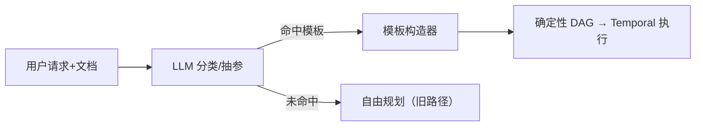

# 办公功能清单与实现文档

> 办公模式的基础办公能力以"技能"形态实现（插件化，注册即生效）。
> 办公模式对话的 LLM 通过 function calling 自动获得本清单中的技能，无需额外接线。
> 最后更新：2026-08-14。

## 1. 功能清单 → 技能映射

| 功能 | 技能名 | 实现方式 | 复用 |
|---|---|---|---|
| 公文/邮件撰写 | `compose_email` / `compose_official_doc` | LLM 生成（邮件含标题；公文按 GB/T 9704 格式） | 新 |
| 多风格改写 | `rewrite_text` | LLM 改写（正式/口语/简洁/学术/营销等） | 新 |
| 会议纪要整理 | `meeting_minutes` | LLM 结构化整理（议题/决议/待办） | 新 |
| 长文摘要 | `summarize_text` | LLM 摘要（要点/一段话/结构化） | 新 |
| 文档问答 | `document_qa` | RAG 检索知识库 + LLM 作答 | **复用 query_knowledge** |
| 信息抽取 | `extract_info` | LLM 抽取指定字段，输出 JSON | 新 |
| 竞品分析 | `competitor_analysis` | 联网搜索竞品公开信息 + LLM 对比分析 | **复用 web_search** |
| 本地文件检索 | （无需新技能） | 复用客户端技能 search_files / grep / list_directory / read_file | **复用** |
| 个人日程/待办 | `todo_manager` | 本地 JSON 存储（按用户隔离），增/查/完成/删 | 新 |
| 敏感词/合规审查 | `compliance_check` | 敏感词表命中 + LLM 上下文判定与修改建议 | 新 |
| 早晚报推送 | `daily_report` | 联网新闻 + 个人知识库 + LLM 生成早晚报（**推送调度待接**） | 复用 web_search/query_knowledge |
| 发票/报销单处理 | `invoice_parse` | LLM 提取发票字段（号码/日期/金额/税额/双方） | 新 |
| 客服自动回复 | `customer_service` | 知识库 FAQ 检索 + LLM 专业回复 | **复用 query_knowledge** |
| 语音转文字+总结 | `speech_to_text` | 上传音频（/uploads 附件）→ Whisper 转写 + 纠错 → 复用 summarize_text 做简要总结 | **复用 summarize_text / Whisper** |

## 2. 技能文件位置

- `plugins/skills/office/writing.py`：邮件 / 公文 / 改写 / 摘要 / 纪要
- `plugins/skills/office/extract.py`：信息抽取 / 发票 / 合规审查
- `plugins/skills/office/research.py`：文档问答 / 竞品分析 / 客服回复
- `plugins/skills/office/todo.py`：日程待办
- `plugins/skills/office/report.py`：早晚报
- `app/services/office_skill_utils.py`：公共 LLM 封装 + 敏感词表

## 3. 使用方式

- 办公模式对话直接提问（如"帮我写一封请假的邮件"、"整理一下这段会议记录"），
  大模型会自动调用对应技能；也可在编排中由 agent 调用。
- 技能场景：`scenes=["office", "chat"]`（办公 + 普通对话可用）。
- 敏感词表在 `office_skill_utils.SENSITIVE_WORDS`，可按需增删。

## 3.1 技能 vs 智能体（重要概念）

- **技能（Skill）**：原子能力，LLM 在办公对话里通过 function calling 直接调用。
  办公功能清单全部是技能，位于 `plugins/skills/office/`。
- **智能体（Agent）**：多智能体编排（DAG）里的执行节点，包装一个或多个技能。
  当前注册的办公 agents（`app/agents/roles/office/agents.py`）：

| Agent | 职责 | 包装的技能 |
|---|---|---|
| `office_text` | 邮件/公文/改写/摘要/纪要/抽取/合规 | compose_email / compose_official_doc / rewrite_text / summarize_text / meeting_minutes / extract_info / invoice_parse / compliance_check |
| `office_research` | 竞品/文档问答/客服/早晚报 | competitor_analysis / document_qa / customer_service / daily_report |
| `office_todo` | 日程待办 | todo_manager |
| `office_doc` | 办公文档读取/编辑/分析（带 doc_id） | office_doc_read / office_doc_edit / office_doc_analyze |

写代码 agents（code / code_reader / code_writer / code_tester / code_reviewer）
仍按 `AGENT_DISABLED` 屏蔽，代码文件保留在 `roles/code/`，清空配置即可恢复。

## 3.2 多任务路由

办公模式对话提交时，前端做文档/多任务判定：

- **上传了文档，或指令含多任务/跨领域**（含"并且/同时/还要"等连接词，或 ≥3 个任务动词）→ 提交多智能体任务，
  规划器拆 DAG，按领域路由到 `office_text` / `office_research` / `office_doc` / `office_todo` 等节点；
- **单任务指令** → 走普通对话（技能层直接调用，更快）；
- 前端上传办公文档后把 **`{doc_id, filename, kind}` 列表**存入全局 store 并随任务提交，
  规划器上下文带 `文件名(doc_id=...)` 映射，按文件名把正确 doc_id 放到 office_doc 节点上；
  即文档任务走 **思考（规划器）→ 计划（任务 DAG）→ 执行（office agents）** 的 React+DAG 编排。

`office_docs` 贯穿链路：`CreateAgentJobRequest → /agents/jobs → submit_job → planner.plan → 规划上下文`。

## 3.2.1 办公任务 = 分析 + 按指令处理（不是只分析）

规划器提示词区分代码任务与办公任务：

- **代码任务**：reader → writer → tester/reviewer 链路；
- **办公任务**：先 `office_doc`（mode=analyze/read，带 doc_id）分析/读取文档，
  再按用户指令**产出**：`office_text`（邮件/公文/改写/摘要/纪要）、
  `office_research`（竞品/问答/客服/早晚报）、`office_todo`、`office_doc`（mode=edit 修改文档）；
  产出节点 depends_on 分析节点，保证"先读到文档再产出"。

前端气泡任务完成后显示"处理结果"区：每个办公/检索节点的完整产出
（邮件正文、总结、分析答案等）不再只显示步骤标题。

## 3.2.2 最终交付（汇总答案）

多智能体任务跑完不再"纯干活不交付"：工作流收尾前执行
`synthesize_final_answer_activity`——把**用户请求 + 各已完成节点的产出**交给 LLM，
合成一段最终交付内容（总结、邮件正文、分析结论等），存入 `job.result.final_answer`。

前端气泡在任务完成后于顶部展示 `final_answer`（完整答案），
步骤与处理结果降为过程展示。汇总失败不影响任务完成（节点结果仍可见）。

## 3.2.3 模板流程库（稳定层）

规划从"LLM 从零写 DAG"降级为"**LLM 分类 + 参数抽取 → 模板构造器生成确定性 DAG**"：

已内置模板（`app/agents/orchestration/templates.py`）：

| 模板 | 场景 | 参数 |
|---|---|---|
| `document_analysis_flow` | 上传文档 → 分析 → 总结/邮件/改写/纪要/抽取 | doc_ids / task / mode |
| `invoice_filter_flow` | 发票筛选(阈值) → 汇总表 → 高额邮件 | threshold / alert_threshold / notify |
| `daily_brief_flow` | 早报/晚报生成 | period / focus |
| `document_compare_flow` | 两份文档对比（读取→按维度对比） | doc_ids / dimensions |
| `document_combine_flow` | 多份文档合并汇总（读取→综合总结/报告） | doc_ids / output |
| `document_translate_flow` | 文档翻译（读取→翻译成目标语言） | target_lang |

流程：`LlmPlanner._plan_with_template`（LLM 输出 `{template, params}`）→
`FlowTemplate.build()` 生成节点（含依赖关系，如"产出节点 depends_on 分析节点"）；
模板未命中/失败 → 回退自由规划 + office_doc 兜底注入。

## 3.2.4 可控 DAG 骨架（意图分类 / 模式 / 校验 / 审批）

### 意图分类（`app/agents/orchestration/intent.py`）

规则粗分类，把任务分流到三条路径，**不先让 LLM 自由规划**：

| 类型 | 判定 | 处理 |
|---|---|---|
| 模板任务 | 高频关键词命中（发票/报销/早报/总结等） | 规则抽参（免 LLM）→ 模板构造 DAG |
| 半结构任务 | 含条件/分发关键词（如果/超过/并且/还要…） | LLM 选模式 + 填参数 → 模式构造 DAG |
| 自由任务 | 其余复杂流程 | Plan-then-Execute（LLM 自由规划 + office_doc 兜底） |

### 模式库（`app/agents/orchestration/patterns.py`）

- `etl`：Reader → Transformer → Writer
- `router`：Reader → Condition → 通知/分发

### DAG 校验器（`app/agents/orchestration/dag.py`）

`validate_planned_dag`：agent 已注册 / 必选参数 / 无环 / id 唯一；
校验失败 → 降级为知识库检索流程（避免必失败的 DAG），并在 orchestrator.submit_job 接入。

### 审批门控（Human-in-the-Loop）

- `TaskNode.approval / approval_note`：高风险节点标记（如发送高额发票邮件，模板默认 approval=true）；
- 工作流遇到审批节点：任务进入 `waiting_approval` 状态，等待 `approve_task` 信号；
- API：`POST /agents/jobs/{id}/approve {node_id, approved}`；
- 前端气泡显示审批卡片（操作摘要 + 影响范围 + 风险等级），批准/拒绝后继续。

## 3.2.5 可靠性骨架（规则 / Plan 文本 / 案例 Few-Shot）

### 规则引擎（`app/agents/rules.py`）

硬逻辑不交给 LLM：在 `WorkerAgent.run_skill` 执行前动态校验
（必填字段/阈值等，如 office_doc 缺 doc_id、邮件内容为空），违规拦截（`RULE_VIOLATION`）。
规则按 (agent, skill) 组织，可扩展。

### Plan 文本 + DAG JSON（自由规划器）

自由规划输出 `{"plan": "...", "tasks": [...]}`：Plan 文本（给用户看/审计）存 `job.plan_text`，
前端气泡折叠展示"执行计划"；DAG JSON 交给校验器后进 Temporal。

### 成功任务案例库（`app/agents/orchestration/cases.py`）

- 汇总活动（任务收尾）自动保存成功案例（Redis cap 100）；
- 自由规划器按请求相似度（中文 2-gram + 英文词重叠）检索 top3 历史案例做 Few-Shot，
  提升规划质量。

## 3.2.6 记忆层 / 幂等 / 写工具渐进开放

### 任务记忆（`app/agents/memory/task_memory.py` + `task_memory` 技能）

- Redis 按 job 存储（`task_memory:{job_id}`，TTL 6h）；
- `task_memory` 技能：remember/recall，办公 agents 已挂载；
- 节点完成后自动沉淀摘要；最终汇总时把任务记忆一并交给 LLM（跨步骤上下文不丢）。

### 操作级幂等（`orchestrator.submit_job`）

30 秒内相同请求且任务未结束（running/pending/waiting_approval）→ 直接返回已有任务，防重复提交。

### 写工具渐进开放（Skill.write_op + `AGENT_TOOL_WRITE_ENABLED`）

- `Skill.write_op=True` 标记写操作（office_doc_edit / todo_manager / install_new_dependencies 等）；
- `AGENT_TOOL_WRITE_ENABLED=False` 时执行器向 LLM 隐藏写操作技能（只读先行）；
- 默认 True（保持现有能力），机制已就绪，后续按阶段开放。

## 3.3 统一文件上传（输入框）

独立的"上传文件/文件夹"页面已移除，统一为输入框内的上传按钮（图片按钮旁）：

- 点击 → Electron 对话框可选择**文件或文件夹**（可多选，文件夹递归枚举，单文件 ≤20MB）；
- **Ctrl+V 粘贴**文件到输入框同样入队；
- 待传文件按类型分流：图片/音频 → 聊天附件；docx/xlsx/pptx/md/txt/json/csv → 自动创建
  办公文档会话（**支持一条消息传多个文档**：doc_id 列表进 store，消息提示 `文件名=doc_id` 对，
  模型/规划器按文档名匹配正确 doc_id 调用 office_doc 技能）；
- 主进程 `upload:pickFilesAndFolders` IPC 负责读取文件内容（base64 回传）。

`office_doc_ids` 贯穿链路（列表）：`CreateAgentJobRequest → /agents/jobs → submit_job → planner.plan → 规划上下文`。
独立的 ProjectPanel / OfficeDocPanel 组件已删除（统一由输入框上传按钮接管）。

## 4. 说明与后续

- 发票解析目前接收文字（图片可先经多模态模型转文字）；如需原生 OCR 可后续接入。
- 早晚报的"推送"（定时发送）尚未接入：可复用后端定时任务（Celery beat）生成后推送，
  或接入应用内自动提醒；本技能只负责内容生成。
- 待办存储于 `data/todos/{user_id}.json`，仅本机后端；后续可迁移到数据库。

## 5. 办公文档编辑（结构化编辑，复用缓冲语义）

### 5.1 能力

- **Word / Excel / PPT**：结构化编辑（python-docx / openpyxl / python-pptx），
  只读写结构（段落/表格/单元格/页面文本），不碰二进制流；
- **Markdown / Txt / Json / CSV / YAML**：纯文本——全量重写或 SEARCH/REPLACE 补丁；
- **缓冲审核**：编辑只作用于 `buffered` 副本，前端预览确认后才落盘，可随时丢弃。
- **RAG 分析**：总结/问答类指令把文档全文转成**会话专属私有 RAG 空间**
  （复用分块/嵌入/混合检索管线），检索相关片段后由 LLM 作答并带来源；
  会话丢弃时空间一并删除，不污染个人知识库。

### 5.2 数据流

上传（`POST /office/docs`）→ 读取结构（段落/单元格/页面文本）
→ 自然语言编辑指令（`POST /office/docs/{id}/edit`，LLM 规划操作 JSON）
→ 应用到缓冲副本 → 返回修改记录 + 结构预览
→ 用户审核（前端面板）→ 保存到本地（`GET /office/docs/{id}/file` + 保存对话框）或丢弃。

分析路径：`POST /office/docs/{id}/analyze`（mode=qa/summary）→ 会话 RAG 检索 → LLM 作答 + 引用。

### 5.3 编辑操作示例

- xlsx：`{"op":"replace_all","sheet":"员工表","find":"张三","replace":"李四"}`
- docx：`{"op":"replace_paragraph","index":1,"text":"第二章 详细说明"}`
- pptx：`{"op":"replace_text","slide_index":0,"find":"旧词","replace":"新词"}`
- text：`{"op":"search_replace","old":"原文","new":"新文"}` / `{"op":"rewrite","content":"全文"}`

### 5.4 组件

- 后端引擎：`app/services/office_docs.py`（会话/结构读取/操作应用/缓冲）
- API：`app/api/v1/office_docs.py`（上传/查看/编辑/下载/丢弃）
- 技能：`office_doc_read` / `office_doc_edit` / `office_doc_analyze`（agent 可调用，场景 office）
- 前端：`src/components/OfficeDocPanel.jsx`（办公模式"办公文档"按钮）
- 保存：主进程 `office:saveFile`（带鉴权下载 + 保存对话框）

会话目录：`data/office/{user_id}/{doc_id}/original.ext + buffered.ext + meta.json`。
