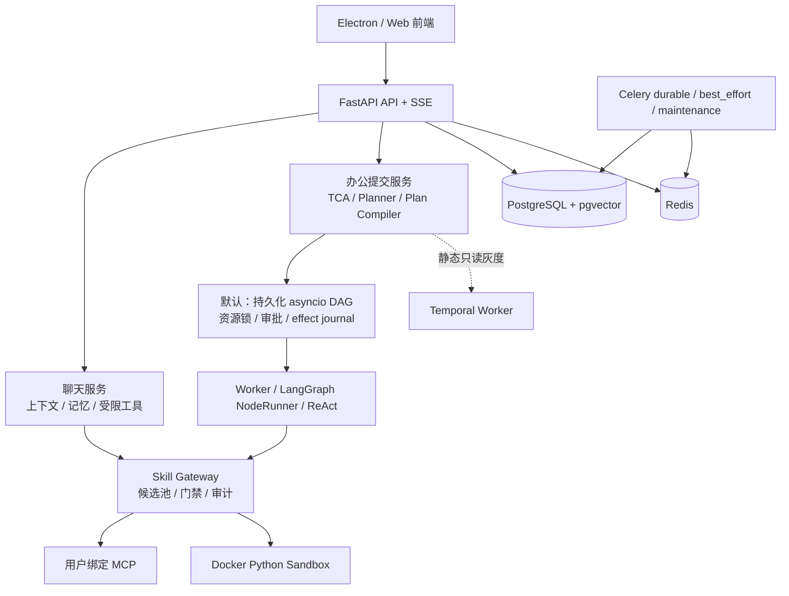

# Lumi 当前系统架构

> 更新：2026-08-23
> 本文是系统级总览；办公编排细节以 [CURRENT_DAG_ARCHITECTURE.md](CURRENT_DAG_ARCHITECTURE.md) 为准。

Lumi 由 Electron 前端、FastAPI 后端、PostgreSQL/Redis、Celery 与可选 Temporal 组成。
普通聊天和办公任务共用用户、模型配置与审计边界，但工具范围和运行时严格分离。

## 1. 运行时事实

| 领域 | 当前实现 | 关键边界 |
| --- | --- | --- |
| 普通聊天 | LLM + 请求级受限工具池 | 不进入办公 DAG；仅按证据注入问答工具 |
| 办公编排 | `AGENT_ORCHESTRATION=legacy` 的持久化 asyncio DAG | `legacy` 只是历史名称；它是默认主运行时 |
| Temporal | 可选灰度 | 只接收可证明安全的静态只读任务或显式纯读清单；不承接写、审批、L3 动态子图 |
| 异步后台 | Celery 三队列 + Beat | 文档解析/索引等 durable，记忆等 best-effort，清理等 maintenance |
| 数据 | PostgreSQL、Redis、受用户隔离的文件目录 | Alembic 是唯一 DDL 所有者；API 启动不建表 |

## 2. 编排内核与业务适配

`packages/orchestration/src/lumi_orch/` 是独立 workspace 包，只保留确定性的、业务无关的
DAG、生命周期、资源租约、effect journal 状态转换、逻辑计划、DSL 和策略 matcher。

`app/agents/orchestration/` 是业务适配层：Redis/PostgreSQL、监控、Worker、Skill、文档范围、
LLM 规划和运行时网关。依赖方向只能是 `app -> lumi_orch`，内核不得导入 `app.*`。

策略数据位于 `config/agent_policies/`。YAML 只能消费注册过的特征并指定有限枚举，不能包含
表达式、动态导入、工具调用、权限提升或 Python 代码；策略加载失败保留上一份有效基线并告警。

## 3. 工具和安全模型

Skill 先经过场景、角色、写开关、运行时可用性、用户 MCP 绑定和资源范围过滤；候选召回只是
在合法池内排序，不能授予能力。模型调用后仍经参数 schema、文档归属、审批、资源锁与
effect journal 复核。写资源或 journal 不可用时 fail-closed。

候选工具池的召回与模型选择分开观测：聊天一次选择，办公 ReAct 每轮刷新。候选 trace 不记录
用户原文、提示词、参数或工具正文。详见 [TOOL_SKILL_EXECUTION_GUIDE.md](TOOL_SKILL_EXECUTION_GUIDE.md)
和 [MCP_SKILL_GOVERNANCE.md](MCP_SKILL_GOVERNANCE.md)。

## 4. 主要文档

| 主题 | 文档 |
| --- | --- |
| DAG、审批、资源、恢复、逻辑计划、Temporal 灰度 | [CURRENT_DAG_ARCHITECTURE.md](CURRENT_DAG_ARCHITECTURE.md) |
| 内核包边界 | [ORCHESTRATION_KERNEL_PACKAGE.md](ORCHESTRATION_KERNEL_PACKAGE.md) |
| 策略 YAML 与特征治理 | [ROUTING_POLICY_MIGRATION.md](ROUTING_POLICY_MIGRATION.md) |
| 工具执行与选择 | [TOOL_SKILL_EXECUTION_GUIDE.md](TOOL_SKILL_EXECUTION_GUIDE.md) |
| MCP / Skill 生命周期 | [MCP_SKILL_GOVERNANCE.md](MCP_SKILL_GOVERNANCE.md) |
| RAG 与记忆 | [RAG_DESIGN.md](RAG_DESIGN.md)、[MEMORY_DESIGN.md](MEMORY_DESIGN.md) |
| 部署与排障 | [OPERATIONS.md](OPERATIONS.md)、[ORCHESTRATION_DEPLOYMENT_GUIDE.md](ORCHESTRATION_DEPLOYMENT_GUIDE.md) |

旧的压测报告、面试材料、踩坑记录和历史兼容入口可以说明演进背景，但不能覆盖本文件或当前
编排架构文档中的运行时结论。
