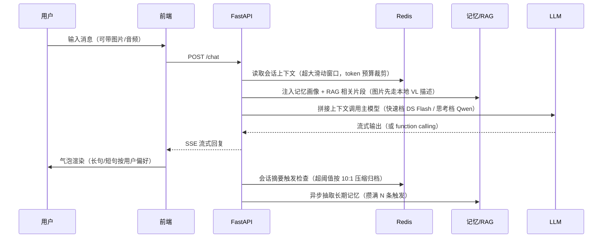
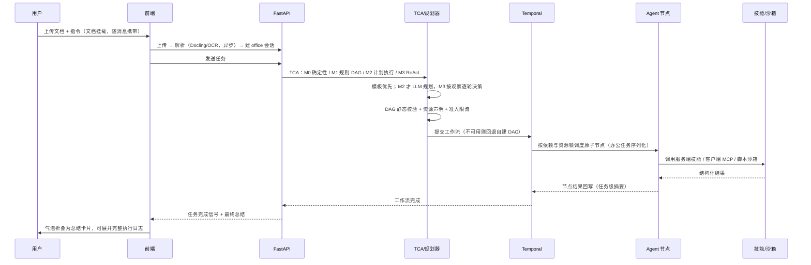
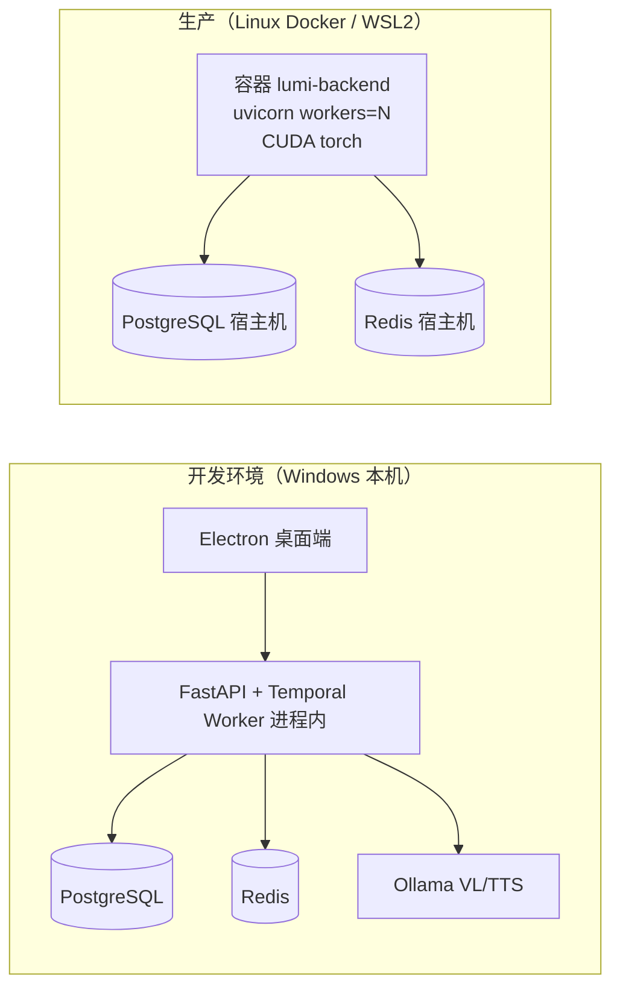

# Lumi 系统架构与技术选型

> 版本：v2.0（2026-08-19）
> 配套文档：`ENGINEERING_PRACTICE.md`（落地策略）、`PRODUCT_DESIGN.md`（个性化设计）、
> `INTERVIEW_PREP.md`（面试准备）、`RAG_DESIGN.md` / `MEMORY_DESIGN.md` / `CONCURRENCY_PERF.md`

## 1. 系统总览

Lumi 是一个**多智能体 AI 办公助手**：Electron 桌面端（React）负责交互与本地能力，
FastAPI 后端负责编排与智能处理，PostgreSQL（pgvector）与 Redis 负责数据与状态，
Temporal 负责长任务编排，Celery 负责异步清洗，本地/云端多路 LLM 提供推理。

```mermaid
flowchart TB
    subgraph Client["桌面端 Electron + React"]
        UI[聊天 / 设置 / 管理后台]
        MCP["MCP Server<br/>127.0.0.1:8765/mcp<br/>打开软件/本地文件/邮件客户端"]
        PREVIEW["Office 预览<br/>docx-preview / pptx-preview / xlsx"]
        LS["本地索引<br/>tree-sitter + sqlite/lancedb"]
    end

    subgraph Backend["FastAPI 后端"]
        API[API 层<br/>auth / chat / office / rag / admin]
        ORCH[编排层<br/>TCA → M0/M1/M2/M3<br/>DAG/资源锁 → Temporal / legacy]
        AGENTS[Agent 角色<br/>office_doc / office_text / office_script<br/>office_calendar / code(可禁用)]
        SKILLS[技能层<br/>plugins/skills 服务端技能]
        RAG[RAG 服务<br/>bge-m3 + pgvector + 混合检索]
        MEM[记忆服务<br/>画像 + 事实库 + 会话摘要]
        SPEECH[语音<br/>Whisper ASR / TTS]
    end

    subgraph Infra["基础设施"]
        PG[(PostgreSQL 18<br/>pgvector)]
        REDIS[(Redis<br/>限流/任务状态/轮询)]
        CELERY[Celery<br/>清洗/向量化/记忆抽取]
        TEMP[Temporal<br/>长任务持久化]
        LLM[LLM 集群<br/>DeepSeek / Qwen / Ollama 本地]
        FS[(文件系统<br/>data/office / office_outputs / uploads)]
    end

    UI --> API
    API --> ORCH
    ORCH --> AGENTS
    AGENTS --> SKILLS
    AGENTS --> MCP
    ORCH --> TEMP
    AGENTS --> RAG
    AGENTS --> MEM
    AGENTS --> SPEECH
    API --> REDIS
    API --> PG
    CELERY --> PG
    CELERY --> REDIS
    SKILLS --> FS
    RAG --> PG
    AGENTS --> LLM
    MCP --> PREVIEW
    LS --> UI
```

## 2. 技术栈选型

| 层 | 选型 | 理由 |
| --- | --- | --- |
| 桌面端 | Electron 43 + React 18 + Vite 6 | 统一前端技术栈，Node 侧可跑本地能力（MCP、tree-sitter、sqlite） |
| 文档预览 | docx-preview / pptx-preview / xlsx | 纯前端渲染 Office 样式，满足"预览与 Office 一致"的产品要求 |
| 服务端 | FastAPI + Uvicorn（异步） | async 全链路，天然适合 SSE/WebSocket 推送与流式 LLM |
| ORM/迁移 | SQLAlchemy 2.0 async + Alembic | 成熟异步 ORM；迁移可版本化（0001 baseline / 0002 email_client） |
| 数据库 | PostgreSQL 18 + pgvector | 向量检索与业务数据同库，省一套运维；ivfflat 适合中等规模 |
| 缓存/队列 | Redis（限流/任务态/轮询）+ Celery | 限流滑动窗口、任务摘要、消息裁剪；Celery 做异步清洗与抽取 |
| 编排 | TCA + Temporal（回退自建 DAG）+ LangGraph | 复杂度分层、长任务持久化、节点恢复；不可用时降级 legacy DAG |
| 向量模型 | BAAI/bge-m3（1024 维） | 中英文混合效果好，本地推理，隐私可控 |
| LLM | DeepSeek（1M 上下文快速档）/ Qwen（思考档）/ Ollama VL/TTS | 快速档省钱省时，思考档保质量；多模态图片走本地 VL 描述 |
| 语音 | openai-whisper（ASR）+ dashscope/edge-tts（TTS） | 本地转写可控，云端 TTS 音色丰富 |
| 脚本能力 | tree-sitter（前端索引）+ Python 执行沙箱 | 结构化提取代码块，脚本按需生成执行 |
| 质量 | ruff + pytest + GitHub Actions | 静态检查与单测全绿，CI 门禁 |

## 3. 后端目录结构（关键模块）

```text
app/
  api/v1/            # 路由层：auth / chat / office_docs / rag / admin / health
  agents/
    orchestration/   # TCA、模板/模式/自由规划、DAG/资源锁、LangGraph 节点、Temporal 封装
    roles/           # 角色 Agent：office_doc / office_text / office_script / code*
    skills/          # 技能注册/加载/执行器（原生函数 + MCP 混合）
    mcp/             # MCP 客户端管理器（会话复用、缓存、取消、熔断与降级）
    memory/          # 任务级记忆（Redis 摘要）
    sandbox/         # 本地沙箱（脚本执行隔离）
  core/              # config / database / logging / executors / security
  services/          # office_docs（结构化编辑）、rag、memory、speech 等业务服务
plugins/skills/      # 服务端技能插件目录（desktop/devtools/filesystem/network/
                     #   office/process/shell/system），Docker 挂载可热更新
alembic/versions/    # 数据库迁移
tests/               # 单测（70 passed）
```

## 4. 两条核心链路

### 4.1 普通对话链路



### 4.2 办公任务链路（TCA 分层 + 原子 DAG / ReAct）



## 5. 关键模块设计

### 5.1 多智能体编排（TCA 分层，模板优先）

- **四级调度**：M0 确定性路径 → M1 规则 DAG → M2 Plan-and-Execute → M3 受控 ReAct；
  按引用实体、参数显式度、依赖、模糊度与历史依赖评估，而不是按业务名称硬分流。
- **模板库**：document_analysis / invoice_filter / daily_brief / document_compare /
  document_combine / document_translate，见 `app/agents/orchestration/templates.py`。
- **DAG 校验**：`review.py` 静态校验无环、节点唯一、工具注册、必选参数；失败降级或生成澄清。
- **文档兜底**：规划结果未覆盖已上传文档时强制补 `office_doc` 分析节点，不依赖 LLM 自觉。
- **节点恢复**：两条执行引擎均使用 LangGraph `execute → assess → retry/finish`；失败分类后有界换工具或升级重规划。
- **执行引擎**：默认由持久化动态 DAG 执行；`manifest_temporal` 是本地验证中的纯读清单
  Worker 路径，验证滚动批次、重试、超时与恢复。L2 审批、L3 动态子图和写操作仍保留在动态 DAG
  （`AGENT_ORCHESTRATION=legacy|manifest_temporal`）。
- **经验闭环**：仅成功的 M1/M2 计划以用户隔离、文档占位符化的方式写入 Redis 计划缓存。

### 5.2 混合技能架构（原生函数 + MCP）

- **服务端技能**：`plugins/skills/*`，原生 Python 函数注册，适合文档处理/LLM 调用等后端能力。
- **客户端技能**：Electron 主进程通过官方 MCP SDK 暴露 Streamable HTTP server（`http://127.0.0.1:8765/mcp`），
  负责打开软件、读写本地文件、唤起邮件客户端等"必须在本机"的操作；会话工具快照隔离，热更新只影响新会话。
- **会话与降级**：后端每 server 复用初始化会话、缓存工具清单、熔断/失败冷却；不可用时回退 Redis 轮询。
- **安全与控制**：loopback + `/mcp` + Host/Origin/DNS rebinding 防护；任务可携带 deadline/进度，取消时发送 MCP 标准取消通知。
- **工具治理**：技能按场景白名单暴露（`scenes`），写操作分级（高危需人工确认），
  全部写操作留审计日志（control_logs）。

### 5.3 办公文档处理

- **结构化编辑**：docx/xlsx/pptx 按 OP_SCHEMAS 生成编辑指令 JSON，套用缓冲副本，
  前端 Office 同款预览，用户"保留/撤销"后落盘（详见 `PRODUCT_DESIGN.md`）。
- **只读解析**：PDF/ODT/图片走 Docling + RapidOCR；老版 Office（doc/xls/ppt）走本机 COM。
- **脚本处理**：csv/md/txt 等文本类走全量重写或 SEARCH/REPLACE 补丁；
  复杂批量任务由 `office_script` 两阶段生成 Python 脚本（伪代码 → 代码）后进沙箱执行。

### 5.4 RAG 与记忆

- RAG：bge-m3 1024 维 + pgvector 余弦检索，按代码、结构化文本、表格与 Markdown/Docling
  分块；长期资料走向量 + 关键词 RRF + 时效重排，默认纯向量阈值 0.5（生产值由评测集确定）。
  办公附件只由显式 DAG 节点读取，小附件全文注入、大附件检索会话临时空间；不会与长期记忆混搜。
- 记忆：画像 + 事实库两级（常驻注入 + 按需召回），隐私分级（PII 不落库、
  私密信息加密），会话超阈值后 10:1 压缩归档（详见 `MEMORY_DESIGN.md`）。

### 5.5 语音链路

- ASR：openai-whisper 本地转写（base 模型，中文），qwen-turbo 纠错。
- TTS：dashscope cosyvoice / edge-tts 兜底 / 本地 qwen3-tts；流式短句触发，
  不等整段输出完毕。
- 语音通话：快速档 DS Flash 回复 + TTS 播报，视频通话为占位（CallPanel）。

## 6. 部署拓扑



关键参数：

| 参数 | 建议 | 说明 |
| --- | --- | --- |
| `DB_POOL_SIZE` / `DB_MAX_OVERFLOW` | 10 / 20 | N worker × 30 < Postgres max_connections |
| `COMPUTE_THREADS` | 4 | OCR/Embedding/TTS 专用线程池，每进程一份 |
| `LLM_HISTORY_MAX_TOKENS` | 250000 | 普通模式超大短期窗口 |
| `LLM_HISTORY_MAX_TOKENS_WORK` | 60000 | 办公模式短期窗口 |
| `AGENT_NODE_CONCURRENCY` | 2 | 运行时 DAG 并发上限；办公任务当前强制串行原子步骤 |
| `AGENT_NODE_MAX_RETRIES` | 1 | 单节点有界恢复次数 |
| `AGENT_USER_ACTIVE_JOB_LIMIT` | 2 | 单用户并发办公任务上限 |
| `MCP_TOOL_TIMEOUT_S` | 180 | MCP 工具 deadline |
| `GENERATED_FILES_TTL_DAYS` | 7 | 脚本产物自动清理 |
| `SANDBOX_TEMP_TTL_HOURS` | 6 | 沙箱临时目录兜底清理 |

## 7. 关键设计决策记录（ADR 简表）

| # | 决策 | 理由 |
| --- | --- | --- |
| A1 | 聊天框文档"挂载"链路与知识空间分离 | 短期任务文档不留档，避免污染长期知识库 |
| A2 | 编辑一律走缓冲副本 + 人工审核落盘 | 不可逆写操作前必须可预览、可撤销 |
| A3 | 模板优先于 LLM 自由规划 | 高频场景出错率大幅下降，LLM 只做分类+抽参 |
| A4 | 客户端技能走 MCP、服务端技能走原生函数 | 可插拔、可热更新，按环境就近执行 |
| A5 | 计算密集任务用独立线程池 | 防止占满默认线程池饿死 Web 后台任务 |
| A6 | 日志用 QueueHandler 队列化 | 保留可观测性，避免同步写文件阻塞事件循环 |
| A7 | 连接池可配置且多 worker 受 max_connections 约束 | 实测池锁是 Windows DB 并发瓶颈，用多 worker 扩展 |
| A8 | 普通模式超大短期窗口 + 摘要归档 | 适配 1M 上下文模型，兼顾速度/成本 |
| A9 | 分域检索 + 阈值由评测集确定 | 资料、办公附件、记忆不混搜；避免盲调阈值造成召回或噪声回归 |
| A10 | Temporal 不可用时回退自建 DAG | 单机部署无外部依赖也能跑通 |
| A11 | 普通聊天与办公执行能力隔离 | 避免聊天模型获得本地写入、Shell 和项目开发权限 |
| A12 | MCP 使用官方 Streamable HTTP SDK 与会话工具快照 | 保证生态兼容，并防止多会话热更新串线 |

## 8. 演进路线图

1. **定时触发**：Celery beat 已就绪，补"定时触发办公模板 DAG"（早晚报/待办提醒）。
2. **邮件真实发送**：目前打开客户端草稿；接入 IMAP/SMTP 授权后支持直接发送 + 审批门控。
3. **PDF 结构化编辑**：Docling 结构回写，补 OP_SCHEMAS 的表格/样式操作。
4. **多端同步**：设置偏好已同步；会话/知识库跨端迁移。
5. **分布式扩展**：读写分离、Kafka 削峰、分片检索（当前单机已满足单人/小团队）。

详见 [AGENT_ORCHESTRATION_MCP.md](AGENT_ORCHESTRATION_MCP.md)。
